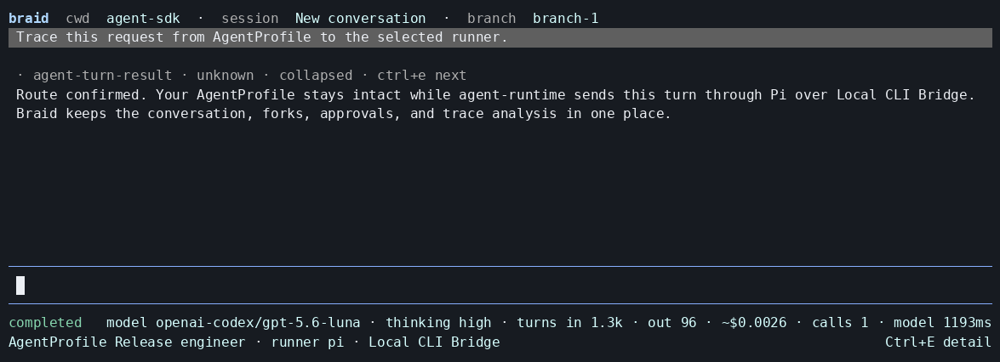

<div align="center">
  <h1>Braid</h1>
  <p><strong>One AgentProfile. Any coding runner.</strong></p>
  <p>Keep one conversation and agent identity while <code>agent-runtime</code> routes each turn through local subscriptions, Tangle inference, or cloud sandboxes.</p>
  <p>
    <a href="https://github.com/tangle-network/braid/actions/workflows/ci.yml"></a>
    <a href="LICENSE"></a>
  </p>
</div>


<p align="center"><sub>Recorded from a clean install of Braid's packed tarball at 120×18.
Repeatable demo data keeps provider credentials out of the repository; the terminal, keyboard flow, profile routing, normalized events, and analysis screen are the real product.</sub></p>

Braid is the terminal experience over [`agent-runtime`](https://github.com/tangle-network/agent-runtime).
It does not replace Pi, Codex, Kimi Code, or OpenCode.
It lets one portable [`AgentProfile`](https://github.com/tangle-network/agent-sdk/tree/main/packages/agent-interface) drive any supported runner while Braid owns conversations, branches, approvals, activity, graphs, and trace analysis.

## Start

Braid requires Node.js 22.19 or newer and pnpm 11.18.
Until the first registry release, run it from source:

```bash
git clone https://github.com/tangle-network/braid.git
cd braid
corepack enable
pnpm install --frozen-lockfile
pnpm build
node dist/bin/braid.js
```

The first launch guides you through choosing an AgentProfile and a connection.
To explore the terminal without credentials or network access:

```bash
node dist/bin/braid.js --fixture deterministic
```

## The core idea

An AgentProfile defines the agent: its instructions, model preferences, tools, skills, permissions, and runner preference.
A connection defines how this run reaches compute.
Changing the connection or runner does not silently create a different agent.

```ts
import type { AgentProfile } from '@tangle-network/agent-interface'

const profile: AgentProfile = {
  name: 'Release engineer',
  harness: 'pi',
  model: {
    provider: 'openai-codex',
    default: 'openai-codex/gpt-5.6-luna',
    reasoningEffort: 'high',
  },
  prompt: {
    instructions: [
      'Inspect the repository before changing it.',
      'Run focused checks and report exact evidence.',
    ],
  },
  tools: { read: true, write: true, shell: true },
  permissions: { read: 'allow', write: 'ask', shell: 'ask' },
}
```

The SDK field is named `harness`; Braid renders it as **runner** because it is a routing preference, not the agent's identity.
The exact profile snapshot and selected connection are bound to every admitted run.

```text
AgentProfile + message
          │
          ▼
        Braid ─── conversation · branches · approvals · graphs · analysis
          │
          ▼
    agent-runtime
      ├── CLI Bridge ─── Pi · Codex · Kimi Code · OpenCode
      ├── Tangle inference
      └── Tangle sandbox
```

Every supported provider output is projected into one event stream.
The terminal renders reasoning, tools, artifacts, usage, interactions, failures, and final output when the selected route reports them.

## What you can do

| Need | Surface |
| --- | --- |
| Choose the agent and route | `/profile`, `/connection`, `/runner`, `/model`, `/effort` |
| Work with conversations | `/new`, `/open`, `/branch`, `/clone`, `/fork`, `/graph` |
| Inspect execution | `F2`, `/activity`, `Ctrl+E`, `/export` |
| Answer or automate requests | `/approve`, `/reject`, `/automate` |
| Improve a run | `/ask <question>`, `/analyze <recipe>`, `/compare <left> <right>` |
| Control active work | `/queue`, `/steer`, `/cancel` |

Commands are enabled from the selected provider's reported capabilities.
Unsupported operations stay visible with a concrete reason instead of pretending to succeed.

### Forks that explain themselves

`/fork` previews exactly what will be copied: conversation context, provider state, profile snapshot, checkpoint, and cloud workspace when available.
The graph view keeps the resulting conversations, branches, runs, workers, and analyses connected.

### Analysis inside the conversation

`/ask` freezes a completed run, sends its trace through `agent-eval`, and returns cited findings without rewriting the original conversation.
`/analyze` runs named failure, cost, tool, or improvement recipes.
`/compare` keeps the full baseline/candidate asymmetry visible before presenting a result.

### Local subscriptions and cloud execution

CLI Bridge lets Braid use existing local subscriptions through runners such as Pi or Codex.
Tangle connections route the same profile through inference or an isolated cloud sandbox.
The terminal keeps one interaction model across those routes.

### Know where work ran and what it cost

`/activity` shows direct turns, trace analyses, supervisors, and workers without combining them into one misleading total.
Each model call can report input, output, cache use, cost, and latency.
Braid labels missing provider values as unknown instead of zero.

Sandbox runs link to their execution environment.
The environment view shows lifecycle, cleanup, continuity, region, machine identity, requested resources, sampled CPU and memory, GPU lease and billing, and account limits when the provider reports them.
It also lists every field that the provider did not expose.

## Headless operation

The terminal and automation surfaces share the same command registry, state projection, and operation records.
Use JSON Lines RPC when another program drives Braid:

```bash
node dist/bin/braid.js rpc
```

Use `--plain` for a readable non-interactive event stream.
RPC mutating commands require operation IDs, making retries explicit and safe.
See the [runtime contracts](docs/04-runtime-contracts.md) for the protocol and event boundaries.

<details>
<summary>Static terminal frame</summary>



</details>

## Current status

Braid is source-installable and is not yet published to npm.
Retained packed-product evidence from 2026-08-09 covers Pi/GLM-5.2 and Codex through first-run setup, two-turn continuity, restart, transcript recovery, and a post-restart turn.
The current Runtime 0.131.5 candidate has deterministic coverage of the strict Bridge protocol.
Protected runner and Tangle checks must run again against the exact release candidate.
Tangle inference and sandbox adapters are implemented against the current provider packages; protected live-deployment checks remain before the first registry release.
General interaction responses remain disabled when the selected runtime cannot acknowledge the response operation.

The exact release criteria and retained evidence live in the [verification plan](docs/08-verification.md) and [delivery plan](docs/09-delivery-plan.md).

## Develop

```bash
pnpm install --frozen-lockfile
pnpm check
pnpm capture:visual
```

`pnpm check` runs formatting, linting, types, dependency boundaries, license checks, deterministic tests, packed CLI Bridge compatibility, and the release manifest check.
`pnpm capture:visual` installs the generated package tarball and drives the real binary through a pseudo-terminal to regenerate the screenshots and GIF.

The design and implementation contracts are split by responsibility:

- [Product contract](docs/01-product-contract.md) and [experience specification](docs/02-experience-specification.md)
- [Architecture](docs/03-architecture.md) and [runtime contracts](docs/04-runtime-contracts.md)
- [Profiles and connections](docs/05-profiles-and-connections.md)
- [Conversations, forks, and analysis](docs/06-conversations-forks-and-analysis.md)
- [Security and privacy](docs/07-security-and-privacy.md)
- [Verification](docs/08-verification.md) and [delivery](docs/09-delivery-plan.md)

## Open-source foundation

Braid uses the MIT-licensed [`@earendil-works/pi-tui`](https://www.npmjs.com/package/@earendil-works/pi-tui) renderer and adapts proven interaction patterns from [Pi](https://github.com/earendil-works/pi), [Kimi Code](https://github.com/MoonshotAI/kimi-code), [OpenCode](https://github.com/anomalyco/opencode), and [Codex](https://github.com/openai/codex).
It deliberately does not copy their execution loops, provider sessions, authentication systems, or model registries; those responsibilities stay behind `agent-runtime` and provider packages.

See [the renderer decision](docs/decisions/001-pi-tui-renderer.md), [upstream strategy](docs/10-upstream-strategy.md), and [third-party notices](THIRD_PARTY_NOTICES.md) for the exact boundary and attribution.

## License

[MIT](LICENSE)
