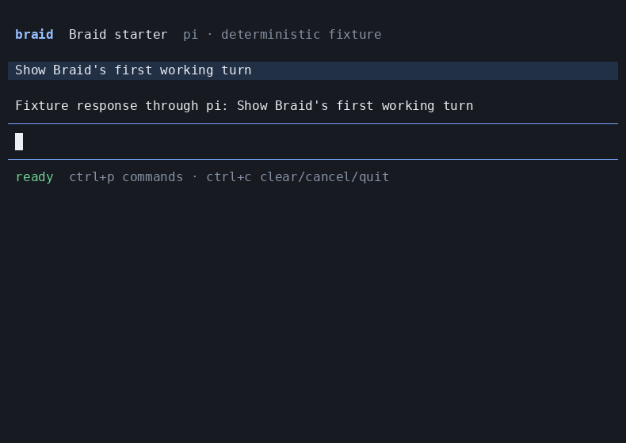

# Braid

Braid is a universal terminal interface for portable agent profiles.

A user chooses an `AgentProfile`, chooses where it should run, and talks to the same agent through local subscriptions, Tangle inference, Tangle sandboxes, or any supported coding runner.

Braid owns the human experience.
`agent-runtime` owns execution.
`agent-interface` owns the profile, event, capability, and interaction contracts.
Provider packages own transport to CLI Bridge and Tangle.
`agent-eval` owns trace analysis and semantic evaluation.

## Status

The W0 vertical slice is implemented: one `braid` binary, one reducer, one JSONL control interface, and one real Pi terminal transcript and composer all drive `agent-runtime`.
W5 is implemented: the domain graph and exhaustive reducer cover the durable product state, effect intents are serialized before external dispatch, and production composition opens an encrypted SQLite journal through `StoragePort` and the operating-system credential port.
The packed binary has deterministic keyboard and JSONL proof, but live CLI Bridge and Tangle connections are not implemented yet.
The deterministic `MemoryJournal` remains fixture-only; production startup fails closed if the pinned encrypted SQLite binding or credential facility is unavailable.
The storage binding is pinned to `better-sqlite3-multiple-ciphers@12.11.1`, operating-system credentials use `@napi-rs/keyring@1.3.0`, and raw database, WAL, shared-memory, backup, wrong-key, restore-recovery, two-process admission, and forced-kill checks run against the native implementations.
The contract is based on current source inspection of `agent-runtime`, `agent-interface`, `cli-bridge`, `agent-eval`, Pi, Kimi Code, OpenCode, and Hermes Agent on 2026-08-02.



Run the deterministic slice locally:

```bash
pnpm install
pnpm run build
node dist/bin/braid.js --fixture deterministic
```

Run `pnpm check`, `pnpm run test:storage`, `pnpm run test:crash`, `pnpm run test:security`, `pnpm run test:performance`, `pnpm run test:install`, and `pnpm run test:capture` to reproduce the W5 checks and terminal captures.
The stable checks are `test:unit`, `test:contract`, `test:coordination`, `test:rpc`, `test:virtual-terminal`, `test:pty`, `test:storage`, `test:crash`, `test:security`, `test:performance`, `test:live`, `test:install`, `test:capture`, and `check:release`.
`test:live` fails closed with an explicit external prerequisite until the published provider adapters and credentials are available.
The complete implementation goal remains every required check in [the delivery plan](docs/09-delivery-plan.md) and [the verification plan](docs/08-verification.md), including real local and cloud runs.

## The central decision

Braid will use the published MIT-licensed [`@earendil-works/pi-tui`](https://www.npmjs.com/package/@earendil-works/pi-tui) package for terminal rendering, layout, editing, overlays, and terminal compatibility.

Braid will selectively adapt proven application-level interaction patterns from [Pi](https://github.com/earendil-works/pi) and [Kimi Code](https://github.com/MoonshotAI/kimi-code), with file-level attribution for copied code.

Braid will not copy an agent loop, provider session model, model registry, authentication system, or profile materializer from another terminal application.

That boundary gives Braid a polished interface quickly without creating a second execution system beside `agent-runtime`.

## Product promises

- The selected profile is the agent, not the selected runner.
- A runner is a per-run preference and may be changed without redefining the agent.
- Every feature is enabled from reported capabilities, never from a hard-coded runner table.
- A reconnect resumes one logical run without duplicating output.
- A fork states exactly whether it copied conversation context, provider state, or a cloud workspace.
- An approval or question is delivered back to the waiting run through a shared interaction contract.
- `/ask` analyzes a frozen run through `agent-eval` and creates a cited child analysis without silently changing the active conversation.
- Credential values and secret-designated interaction answers never enter the transcript, local database, screenshots, or trace artifacts.
- A visual feature is not complete until it has keyboard-flow proof and a captured terminal artifact.

## Documentation map

| Document | Decision it owns |
| --- | --- |
| [Product contract](docs/01-product-contract.md) | Users, outcomes, scope, language, and release promise |
| [Experience specification](docs/02-experience-specification.md) | Screens, workflows, commands, keyboard behavior, and terminal states |
| [Architecture](docs/03-architecture.md) | Module boundaries, state, storage, events, and dependency direction |
| [Runtime contracts](docs/04-runtime-contracts.md) | Existing package capabilities, missing shared APIs, identifiers, and compatibility |
| [Profiles and connections](docs/05-profiles-and-connections.md) | Agent configuration, runner selection, validation, and setup |
| [Conversations and analysis](docs/06-conversations-forks-and-analysis.md) | Sessions, forks, graphs, trace analysis, and automation |
| [Security and privacy](docs/07-security-and-privacy.md) | Trust boundaries, permissions, secrets, terminal safety, and retention |
| [Verification](docs/08-verification.md) | Headless, terminal, live-provider, visual, semantic, security, and performance proof |
| [Delivery plan](docs/09-delivery-plan.md) | Dependency-ordered work, completion criteria, releases, and final sign-off |
| [Upstream strategy](docs/10-upstream-strategy.md) | Pi/Kimi/OpenCode/Hermes comparison, reuse policy, licenses, and update policy |
| [Renderer decision](docs/decisions/001-pi-tui-renderer.md) | Why Braid depends on Pi TUI instead of cloning a whole app |
| [Runtime boundary decision](docs/decisions/002-runtime-boundary.md) | Why execution and interaction control stay upstream |
| [Persistence decision](docs/decisions/003-local-event-journal.md) | What Braid stores and which system remains authoritative |
| [Encrypted storage decision](docs/decisions/005-encrypted-sqlite-and-credential-boundaries.md) | SQLite cipher, content keys, credential facilities, and headless key boundaries |

The ranked source-reuse hypothesis is recorded in [`.agent/hypotheses/2026-08-01-terminal-ui-base.md`](.agent/hypotheses/2026-08-01-terminal-ui-base.md).

## Completion

Braid is complete only when all required checks are linked from one release evidence manifest and that manifest proves the same build in four ways.

1. Deterministic tests prove state, replay, storage, and protocol behavior.
2. A real terminal session proves keyboard workflows and rendering at supported sizes.
3. Real CLI Bridge and Tangle runs prove local subscriptions, cloud execution, reconnect, cancel, interactions, and workspace forks.
4. Calibrated `agent-eval` cases prove that trace analysis and fork behavior are useful and correctly explained to users.

Passing a build, rendering a mock screen, or completing only one provider path does not satisfy the contract.
