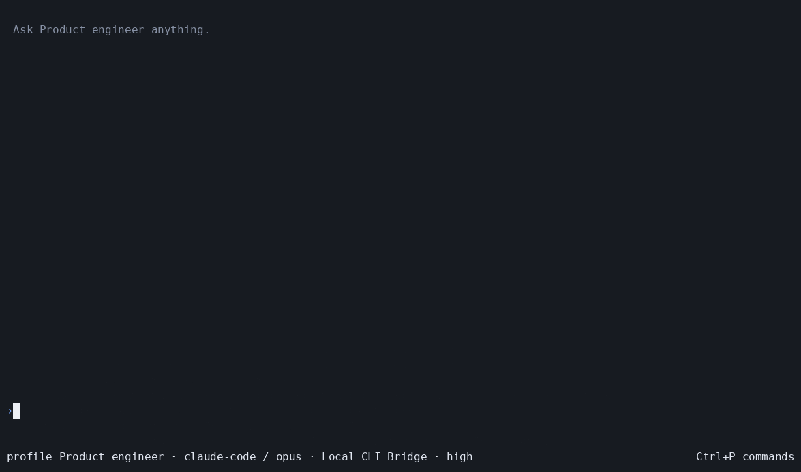

<div align="center">
  <h1>Braid</h1>
  <p><strong>One AgentProfile. Any supported coding runner.</strong></p>
  <p>
    <a href="https://github.com/tangle-network/braid/actions/workflows/ci.yml"></a>
    <a href="LICENSE"></a>
  </p>
</div>

Braid is one durable terminal for coding agents.

A portable [`AgentProfile`](https://github.com/tangle-network/agent-sdk/tree/main/packages/agent-interface) selects the runner, model, instructions, tools, and permissions.

Braid sends every turn through [`agent-runtime`](https://github.com/tangle-network/agent-runtime), then keeps the transcript, branches, approvals, activity, graph, and trace analysis together.



This recording uses a packed Braid artifact and a real `Product engineer` AgentProfile.

It routes one coding task through Local CLI Bridge to Claude Code and `opus`.

It verifies the edited workspace, then switches to a `Trace analyst` AgentProfile on `sonnet`.

It runs `/ask` over the frozen trace and renders cited findings, model calls, tokens, cost provenance, and latency.

The [capture manifest](artifacts/demo/braid-live.json) records the package hash, route, profile, limits, usage, latency, workspace proof, analysis evidence, and artifact hashes.

## Install

Braid requires Node.js 22.19 or newer.

Current validated release targets are Linux x64 and macOS arm64.

The package rejects Windows installation until encrypted state meets the required path-race boundary there.

```bash
npm install --global @tangle-network/braid
braid
```

The first-run flow selects an AgentProfile and a connection.

No runner-specific Braid configuration is required.

For an offline terminal walkthrough, use the deterministic fixture.

```bash
braid --fixture deterministic
```

The fixture proves rendering and state transitions only.

It does not prove a live runner, model, connection, inference route, or sandbox.

## How it works

The core path is deliberately small.

```text
AgentProfile + user turn
        │
        ▼
      Braid
        │  profile snapshot · connection · run limits
        ▼
  agent-runtime
        │
        ├── CLI Bridge ── Pi · Codex · Claude Code · Kimi Code · OpenCode · other runners
        ├── Tangle inference
        └── Tangle sandbox ── remote workspace and environment lifecycle
        │
        ▼
normalized events, receipts, activity, and final output
```

Braid does not implement an agent loop, spawn runner processes directly, parse private runner output, or invent another profile format.

A concrete local route is `AgentProfile` with `harness: 'pi'` → Braid admission → `agent-runtime` → a CLI Bridge connection → Pi → normalized events back to Braid.

## AgentProfile is the configuration unit

`AgentProfile` is the canonical portable definition of one agent.

It can contain the profile name, instructions, model hints, preferred runner, tools, permissions, resources, skills, MCP connections, modes, hooks, and subagent definitions.

The `harness` field in the SDK is a runner preference.

Braid displays that preference as `runner` so the profile remains the agent identity while the execution route remains replaceable.

```ts
import type { AgentProfile } from '@tangle-network/agent-interface'

const profile: AgentProfile = {
  name: 'Release engineer',
  harness: 'pi',
  model: {
    provider: 'tangle-router',
    default: 'tangle-router/glm-5.2',
    reasoningEffort: 'high',
  },
  prompt: {
    instructions: [
      'Inspect the repository before changing it.',
      'Run focused checks and report exact evidence.',
    ],
  },
  tools: { read: true, write: true, shell: true },
  permissions: { read: 'allow', write: 'ask', shell: 'ask' },
}
```

A connection supplies transport and credential references.

The run binds the exact profile snapshot, selected connection, effective runner, model, reasoning effort, output limit, and execution environment before dispatch.

Reasoning effort and maximum output are separate dimensions.

Reasoning effort controls the requested thinking tier when the selected route supports it, while maximum output limits emitted tokens independently.

### Example effective run receipt

The main shell and activity details keep these values together without confusing configuration with provider evidence.

The following values illustrate the shape of one receipt and are not a live run result.

| Field | Example value |
| --- | --- |
| Profile | `Release engineer` |
| Runner | `pi` |
| Model | `tangle-router/glm-5.2` |
| Reasoning | `high` |
| Max output | `16,384 tokens` |
| Connection | `Local CLI Bridge` |
| Execution location | `local workspace through CLI Bridge` |
| Environment | `local process; sandbox fields not applicable` |

When the route is a Tangle sandbox, Braid shows the environment lifecycle and the resources, placement, and machine details that the provider actually reports.

It labels requested, verified, sampled, estimated, and unavailable values separately.

It never fills an unreported IP address, CPU allocation, RAM value, GPU lease, storage value, or cost with a guess.

## One activity view, three kinds of work

Braid keeps direct turns, trace analyses, and runtime workers distinct.

| Activity | What it means | Usage and control |
| --- | --- | --- |
| Turn | A user message admitted to the selected runner | Direct model, tool, latency, and cost values for that run |
| Analysis | A separate `agent-eval` execution over a frozen run or branch | Its own analyst profile, model, tokens, latency, cost, citations, and cancellation |
| Worker | A runtime-owned child under a supervisor | Its own status and usage when reported, with parent binding and control capability |

The activity browser can show all three in one timeline while preserving their separate totals.

An unbound supervisor remains workspace activity and is not silently attributed to the current turn.

Missing provider values remain unknown instead of becoming zero.

## Trace analysis commands

These commands inspect or compare recorded work rather than sending another ordinary prompt to the active coding runner.

| Command | Meaning |
| --- | --- |
| `/ask <question>` | Ask one free-form question about a selected frozen run or branch and return cited findings. |
| `/analyze <recipe>` | Run a named recipe such as `failure`, `cost`, `tools`, or `improvement` through `agent-eval`. |
| `/compare <left> <right>` | Freeze two run or branch sources, show their measured asymmetries, and create a paired comparison. |

`/ask` does not append a message to the analyzed branch.

Each analysis has its own run identity, source digest, analyst profile, model, budget, usage, latency, cost, completeness, and citations.

The standard Braid install includes `uv` for `/ask`.

On first use, `uv` downloads a managed Python 3.12 runtime and runs `agent-eval-rpc[dspy]==0.144.11` in an isolated cached environment.

Set `BRAID_PYTHON` only when an operator must use a preinstalled compatible environment instead.

Findings remain separate until the user explicitly sends selected findings to a branch or forks from the analysis.

## Interactive and headless modes

Interactive mode is the full-screen terminal experience with a multiline composer, streaming transcript, activity pane, selectors, and focused overlays.

Use inline mode when preserving normal terminal scrollback matters.

```bash
braid
braid --inline
```

Headless mode is the same application core behind JSON Lines commands and state records.

```bash
braid rpc
```

Use plain mode for a readable non-interactive event stream without terminal control sequences.

```bash
braid --plain
```

The terminal and JSONL interfaces share command parsing, capability checks, operation identifiers, reducers, persistence, execution ports, and view projections.

Headless clients can send, queue, steer, cancel, detach, reconnect, reconcile, inspect state, inspect activity, run analysis, compare sources, and export records through the versioned protocol.

Mutating headless requests carry stable operation identifiers so a retry can be recognized instead of dispatched twice.

## Attach, resume, and sandboxes

Opening Braid with `--conversation <id>` attaches the interface to a durable Braid conversation and its recorded run bindings.

That operation restores Braid's journal and view state; it does not claim to take over an arbitrary native runner process.

Braid reconnects a non-terminal run from the last committed event cursor only when the selected provider can prove replay or status.

If the provider cannot prove the live state, Braid displays detached, incomplete, expired, unauthorized, or unknown rather than calling the run completed.

Continuing a compatible native provider session requires provider evidence that its context boundary matches Braid's recorded message boundary.

Changing runners creates a new provider session with an explicit portable-context handoff.

It does not claim to transfer hidden process memory, runner-specific todos, opaque tool state, or native session internals.

A Tangle sandbox connection can provide an isolated remote workspace, environment lifecycle, checkpoint, fork, replay, and resource metadata when its capabilities report those operations.

Braid shows those capabilities and their receipts through the same activity and graph surfaces.

The current published Tangle path runs one isolated cloud turn and deletes its environment after the turn.

Cloud restart, retained-session continuation, checkpoint, and fork remain unavailable until the shared provider reports exact recovery support.

The user can inspect the requested and verified execution location, but provider-private machine details remain unavailable when they are not reported.

The latest production stress proof completed 20 of 20 Braid turns through OpenCode, GLM 5.2, and Tangle Sandbox at four-way concurrency.

All 20 remote environments were unique and confirmed deleted, while the account's active Sandbox count returned from four to four.

See the [secret-free proof artifact](artifacts/verification/live/tangle-sandbox-braid-execution-stress-production-20260812.json) for every run, token receipt, latency, environment observation, and cleanup result.

## Commands users reach for first

| Need | Command or key |
| --- | --- |
| Select the agent and route | `/profile`, `/connection`, `/runner`, `/model`, `/effort` |
| Inspect execution | `/activity`, `F2`, `/export` |
| Navigate the work graph | `/graph`, `/fork`, `/branch`, `/clone` |
| Answer or automate a request | `/approve`, `/reject`, `/automate` |
| Control active work | `/queue`, `/steer`, `/cancel` |
| Drive Braid from another process | `braid rpc` |

Commands remain searchable when a provider does not support them.

An unavailable command explains the missing capability instead of pretending that the operation succeeded.

## What Braid owns

| Boundary | Owner |
| --- | --- |
| Portable agent definition and compatibility facts | `agent-interface` |
| Run admission, lifecycle, normalized events, and runtime control | `agent-runtime` |
| Local runner process and native profile materialization | CLI Bridge |
| Tangle inference and remote workspace lifecycle | Tangle provider and sandbox packages |
| Trace analysis and paired comparison | `agent-eval` |
| Conversation journal, branches, graph, approvals, projections, and terminal/headless interfaces | Braid |

Braid adapts these contracts through narrow ports.

It does not duplicate execution, authentication, provider parsing, sandbox scheduling, trace judging, or billing logic.

## Development and proof

```bash
pnpm install --frozen-lockfile
pnpm check
pnpm capture:visual
```

`pnpm check` covers formatting, linting, types, dependency boundaries, attribution, licenses, deterministic tests, live checks, and release checks configured by the repository.

`pnpm capture:visual` drives the built CLI through a pseudo-terminal and records the deterministic terminal evidence required by the verification plan.

The checked-in W6 captures prove deterministic rendering and keyboard paths.

They are not evidence of a live Pi, CLI Bridge, Tangle inference, or Tangle sandbox run.

The [verification plan](docs/08-verification.md) defines the required live, headless, terminal, security, installation, and release evidence.

The [delivery plan](docs/09-delivery-plan.md) records dependency order and completion criteria.

The [product contract](docs/01-product-contract.md), [experience specification](docs/02-experience-specification.md), and [architecture](docs/03-architecture.md) define the user-visible and ownership boundaries.

## Open-source foundation

Braid uses the MIT-licensed [`@earendil-works/pi-tui`](https://www.npmjs.com/package/@earendil-works/pi-tui) package for terminal rendering and input primitives.

Its interaction design takes narrow, application-level patterns from [Pi](https://github.com/earendil-works/pi), [OpenCode](https://github.com/anomalyco/opencode), and [Codex](https://github.com/openai/codex) without copying their agent loops, session stores, authentication systems, provider adapters, or model registries.

See the [renderer decision](docs/decisions/001-pi-tui-renderer.md), [runtime boundary](docs/decisions/002-runtime-boundary.md), [upstream strategy](docs/10-upstream-strategy.md), and [third-party notices](THIRD_PARTY_NOTICES.md) for the exact reuse boundary.

## License

[MIT](LICENSE)
