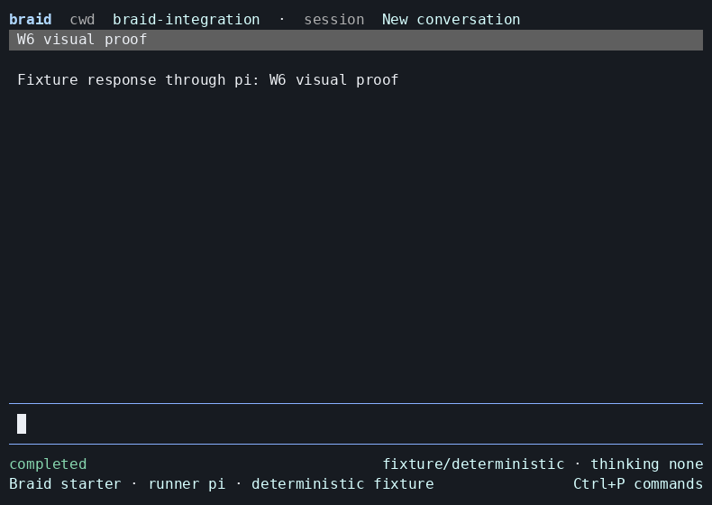

# Braid

Braid is a universal terminal interface for portable agent profiles.

A user chooses an `AgentProfile`, chooses where it should run, and talks to the same agent through local subscriptions, Tangle inference, Tangle sandboxes, or any supported coding runner.

Braid owns the human experience.
`agent-runtime` owns execution.
`agent-interface` owns the profile, event, capability, and interaction contracts.
Provider packages own transport to CLI Bridge and Tangle.
`agent-eval` owns trace analysis and semantic evaluation.

## Status

Braid's production CLI/TUI, encrypted local state, profile and connection setup, runtime dispatch, conversations, branches, graphs, interactions, and analysis commands are implemented.
The terminal and headless surfaces share one command registry, one view model, and one durable operation ledger.
The CLI Bridge path is implemented and was proven from a clean packed install on 2026-08-04 with Pi/GLM-5.2 and Codex through first-run setup, two-turn session continuity, normalized events, process restart, transcript recovery, and a post-restart turn.
The Tangle inference and sandbox paths are implemented against the current provider packages but still require protected live-deployment proof before they are advertised as release-complete.
`/ask`, `/analyze`, `/compare`, trace citations, and analysis promotion are implemented; the semantic evaluation command performs pilot, calibration, and release-case checks when a judge model is configured.
Generalized interaction responses remain capability-disabled because the installed runtime and providers do not expose a run-bound response operation.
The deterministic `MemoryJournal` remains fixture-only; production startup fails closed if the pinned encrypted SQLite binding or credential facility is unavailable.
The storage binding is pinned to `better-sqlite3-multiple-ciphers@12.11.1`, operating-system credentials use `@napi-rs/keyring@1.3.0`, and raw database, WAL, shared-memory, backup, wrong-key, restore-recovery, two-process admission, and forced-kill checks run against the native implementations.
Tangle, supervisor-control, full live-analysis, multi-platform installation, and signed release evidence remain required before the complete release contract is satisfied.
The contract is based on current source inspection of `agent-runtime`, `agent-interface`, `cli-bridge`, `agent-eval`, Pi, Kimi Code, OpenCode, and Hermes Agent through 2026-08-04.



Run the deterministic slice locally:

```bash
pnpm install
pnpm run build
node dist/bin/braid.js --fixture deterministic
```

Run the checks with the stable command map below.
Commands marked unavailable fail with exit code 2 and a plain explanation; they do not substitute a narrower test and do not create a release claim.

| Check | Command | Behavior |
| --- | --- | --- |
| repository | `pnpm check` | Runs local format, lint, types, boundaries, dependency/license metadata, deterministic tests, and the release manifest check |
| unit | `pnpm test:unit` | Runs the local unit suite |
| contract | `pnpm test:contract` | Runs the local contract suite |
| coordination | `pnpm test:coordination` | Runs durable effect admission and serialization checks |
| rpc | `pnpm test:rpc` | Runs the JSONL protocol suite |
| rpc (packed) | `pnpm test:rpc:packed` | Runs the packed JSONL protocol suite |
| virtual-terminal | `pnpm test:virtual-terminal` | Runs virtual-terminal state, keyboard, and layout checks |
| pty | `pnpm test:pty` | Runs packed real-terminal checks |
| storage | `pnpm test:storage` | Runs encrypted SQLite journal, projection, and retention checks |
| crash | `pnpm test:crash` | Runs forced-kill, restore-recovery, and two-process admission checks |
| security | `pnpm test:security` | Runs redaction, credential-boundary, and dependency-boundary checks |
| performance | `pnpm test:performance` | Runs the reducer, coordination, and storage performance checks |
| live | `pnpm test:live` | Unavailable without protected live credentials and evidence |
| live-bridge | `pnpm test:live:bridge` | Runs the opt-in packed CLI Bridge and runner flow with `BRAID_LIVE_BRIDGE=1` |
| live-tangle | `pnpm test:live:tangle` | Unavailable without protected live credentials and evidence |
| live-supervisor | `pnpm test:live:supervisor` | Unavailable without protected live credentials and evidence |
| live-analysis | `pnpm test:live:analysis` | Unavailable without protected live credentials and evidence |
| eval | `pnpm test:eval` | Runs pilot, judge calibration, and semantic release cases against `BRAID_EVAL_MODEL` |
| install | `pnpm test:install` | Runs packed install, storage, and keyboard/RPC proof |
| capture | `pnpm test:capture` | Captures the baseline terminal artifacts from the packed binary |
| visual | `pnpm capture:visual` | Captures the required W6 state artifacts from the packed binary |
| release | `pnpm check:release` | Checks the release manifest and evidence set |
| verify:release | `pnpm verify:release` | Runs only in an isolated clean tracked checkout with external signing key and complete evidence |

The complete implementation goal remains every required check in [the delivery plan](docs/09-delivery-plan.md) and [the verification plan](docs/08-verification.md), including real local and cloud runs.

## The central decision

Braid will use the published MIT-licensed [`@earendil-works/pi-tui`](https://www.npmjs.com/package/@earendil-works/pi-tui) package for terminal rendering, layout, editing, overlays, and terminal compatibility.

Braid will selectively adapt proven application-level interaction patterns from [Pi](https://github.com/earendil-works/pi) and [Kimi Code](https://github.com/MoonshotAI/kimi-code), with file-level attribution for copied code.

Braid will not copy an agent loop, provider session model, model registry, authentication system, or profile materializer from another terminal application.

That boundary gives Braid a polished interface quickly without creating a second execution system beside `agent-runtime`.

## Product promises

- The selected profile is the agent, not the selected runner.
- A runner is a per-run preference and may be changed without redefining the agent.
- Every feature is enabled from reported capabilities, never from a hard-coded runner table.
- A reconnect resumes one logical run without duplicating output.
- A fork states exactly whether it copied conversation context, provider state, or a cloud workspace.
- An approval or question is delivered back to the waiting run through a shared interaction contract.
- `/ask` analyzes a frozen run through `agent-eval` and creates a cited child analysis without silently changing the active conversation.
- Credential values and secret-designated interaction answers never enter the transcript, local database, screenshots, or trace artifacts.
- A visual feature is not complete until it has keyboard-flow proof and a captured terminal artifact.

## Documentation map

| Document | Decision it owns |
| --- | --- |
| [Product contract](docs/01-product-contract.md) | Users, outcomes, scope, language, and release promise |
| [Experience specification](docs/02-experience-specification.md) | Screens, workflows, commands, keyboard behavior, and terminal states |
| [Architecture](docs/03-architecture.md) | Module boundaries, state, storage, events, and dependency direction |
| [Runtime contracts](docs/04-runtime-contracts.md) | Existing package capabilities, missing shared APIs, identifiers, and compatibility |
| [Profiles and connections](docs/05-profiles-and-connections.md) | Agent configuration, runner selection, validation, and setup |
| [Conversations and analysis](docs/06-conversations-forks-and-analysis.md) | Sessions, forks, graphs, trace analysis, and automation |
| [Security and privacy](docs/07-security-and-privacy.md) | Trust boundaries, permissions, secrets, terminal safety, and retention |
| [Verification](docs/08-verification.md) | Headless, terminal, live-provider, visual, semantic, security, and performance proof |
| [Delivery plan](docs/09-delivery-plan.md) | Dependency-ordered work, completion criteria, releases, and final sign-off |
| [Upstream strategy](docs/10-upstream-strategy.md) | Pi/Kimi/OpenCode/Hermes comparison, reuse policy, licenses, and update policy |
| [Renderer decision](docs/decisions/001-pi-tui-renderer.md) | Why Braid depends on Pi TUI instead of cloning a whole app |
| [Runtime boundary decision](docs/decisions/002-runtime-boundary.md) | Why execution and interaction control stay upstream |
| [Persistence decision](docs/decisions/003-local-event-journal.md) | What Braid stores and which system remains authoritative |
| [Encrypted storage decision](docs/decisions/005-encrypted-sqlite-and-credential-boundaries.md) | SQLite cipher, content keys, credential facilities, and headless key boundaries |

The ranked source-reuse hypothesis is recorded in [`.agent/hypotheses/2026-08-01-terminal-ui-base.md`](.agent/hypotheses/2026-08-01-terminal-ui-base.md).

## Completion

Braid is complete only when all required checks are linked from one release evidence manifest and that manifest proves the same build in four ways.

1. Deterministic tests prove state, replay, storage, and protocol behavior.
2. A real terminal session proves keyboard workflows and rendering at supported sizes.
3. Real CLI Bridge and Tangle runs prove local subscriptions, cloud execution, reconnect, cancel, interactions, and workspace forks.
4. Calibrated `agent-eval` cases prove that trace analysis and fork behavior are useful and correctly explained to users.

Passing a build, rendering a mock screen, or completing only one provider path does not satisfy the contract.
