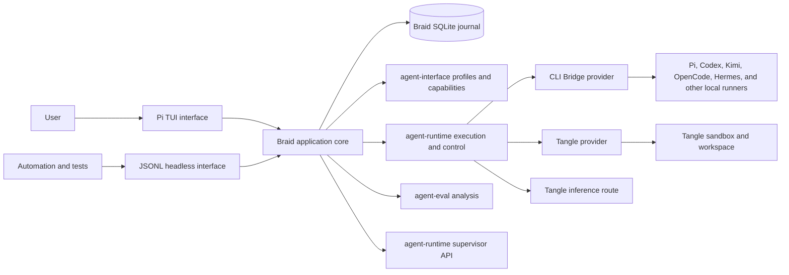
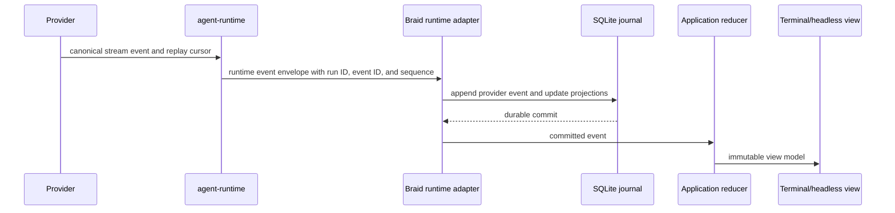
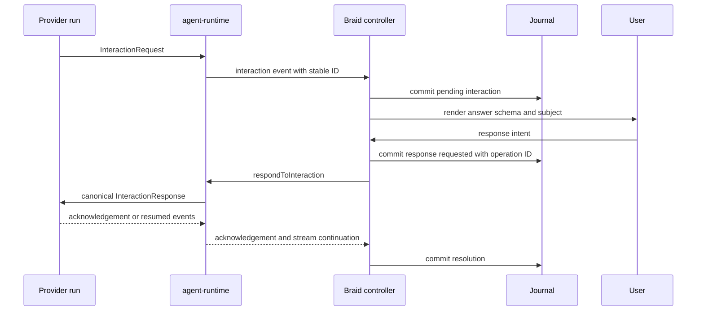

# Architecture

## Architectural statement

Braid is one TypeScript application core with two interfaces: a Pi TUI terminal renderer and a JSONL headless controller.

The core talks to `agent-runtime`, `agent-interface`, provider packages, `agent-eval`, and runtime supervisor APIs through narrow ports.

There is no agent loop, provider-native parser, or profile materializer in Braid.

## System context



The arrows describe dependency direction, not ownership transfer.

## Ownership boundaries

| Concern | Owner | Braid behavior |
| --- | --- | --- |
| Agent definition | `agent-interface` `AgentProfile` | Resolve, validate, inspect, edit, snapshot, and select the canonical type |
| Runner and model compatibility | `agent-interface` helpers | Query helpers and present exact, snapped, ignored, or unsupported values |
| Run admission and lifecycle | `agent-runtime` | Request execution and display normalized state |
| Stream event contract | `agent-interface` and `agent-runtime` | Persist envelopes, reduce to product state, and render |
| Local runner process and profile materialization | CLI Bridge | Configure a connection and display receipts; never spawn or parse directly |
| Cloud sandbox, workspace, checkpoint, and fork | Tangle provider and sandbox package | Invoke capability-reported operations and record bindings |
| Inference routing | Runtime and Tangle provider route | Select connection and show resolved route metadata |
| General interaction request and response | `agent-interface`, runtime, and provider | Render schema and submit a typed response |
| Trace analysis and semantic comparison | `agent-eval` | Select frozen sources, run analysis, and persist cited artifacts |
| Runtime worker tree | `agent-runtime` | Render runtime-owned snapshots and invoke runtime-owned controls |
| Conversation graph and interface decisions | Braid | Persist an append-only journal and derived views |
| Credentials | Provider authentication plus operating-system credential store | Persist only opaque credential references |
| Terminal layout and input | Pi TUI plus Braid components | Render immutable view models and emit intents |

## Dependency rule

The only allowed application dependency direction is `interfaces → controllers → domain/application services → ports → adapters → external packages`.

Views may import view models, semantic theme tokens, and typed intents.

Views may not import `agent-runtime`, provider packages, SQLite, credential APIs, process APIs, or profile mutation services.

Controllers may schedule application operations but may not interpret provider-native payloads.

Adapters may translate shared package types into Braid application events but may not make product decisions.

The domain layer may refer to shared canonical types such as `AgentProfile`, `InteractionRequest`, `InteractionResponse`, capability objects, and normalized runtime events.

No Braid package exports an alternative public profile, event, interaction, or provider protocol.

An automated dependency-boundary test enforces these rules.

## Repository and package shape

Braid begins as one package rather than a monorepo.

The npm package is `@tangle-network/braid` and installs the `braid` executable.

The runtime target is the current supported Node.js 22 line or newer, ESM, strict TypeScript, two-space indentation, single quotes, and no semicolons unless generated code requires them.

`pnpm` manages the repository and the lockfile is committed.

Production dependencies are pinned through the lockfile, while direct compatibility ranges remain narrow enough to prevent an unreviewed shared-contract upgrade.

The initial build emits JavaScript, source maps, and declaration files for the headless client types.

The release publishes npm provenance, an SPDX license inventory, checksums, and installation smoke results.

```text
src/
  bin/                 executable argument parsing and process lifecycle
  app/                 composition root, application state, reducer, and effects
  domain/              Braid identifiers, graph, journal events, and invariants
  controllers/         conversation, run, interaction, profile, analysis, and supervisor workflows
  ports/               execution, profile, analysis, supervisor, storage, credentials, clock, and IDs
  adapters/
    runtime/            agent-runtime stream and control adapter
    cli-bridge/         provider construction and connection health
    tangle/             cloud provider construction and connection health
    eval/               agent-eval analysis adapter
    supervisor/         runtime supervisor adapter
    storage/            encrypted journal, projections, migration, and integrity
    credentials/        operating-system credential references
  commands/             typed built-in command registry and parsers
  views/
    tui/                Pi TUI components, modal coordinator, layout, and themes
    headless/           JSONL request, event, and state presentation
    shared/             immutable view-model builders and redaction
  testing/              deterministic providers, fixtures, virtual terminal, and clocks
test/
  unit/
  contract/
  integration/
  pty/
  live/
  visual/
  security/
scripts/
  verify-release.ts
  capture-terminal.ts
  generate-licenses.ts
```

The layout may be refined during implementation, but ownership and dependency direction may change only through a decision record.

## Application core

The application core consists of immutable state, a pure reducer, typed intents, journal events, and asynchronous effects.

An interface emits an intent such as `SendDraft`, `RespondToInteraction`, `CancelRun`, `ForkBranch`, or `RunAnalysis`.

The reducer validates state-local preconditions and produces a new state plus effect descriptions.

Controllers execute effects through ports and append operation and result events to the journal.

Committed events are reduced into the next durable state and converted into immutable view models.

Both terminal and headless interfaces subscribe to those view models.

Business logic does not live in Pi TUI callbacks or JSONL request handlers.

### Why a reducer

Streaming, reconnect, interactions, background branches, resize, and process restart create many interleavings.

A pure reducer makes every interleaving replayable from a finite event sequence and enables randomized model tests.

It also guarantees that a headless command and the equivalent keyboard action use the same transition.

### Side-effect discipline

Each effect has a stable operation identifier before it reaches an external package.

The terminal interface creates that identifier before journaling the intent.

The headless interface requires the caller to supply it so a retry through a new Braid process preserves the same identity.

The journal binds each operation identifier to a digest of its command kind and canonical parameters.

Reusing an identifier with different parameters is a conflict and never dispatches.

The journal records the requested operation before external dispatch and records its acknowledged, failed, unknown, or terminal result afterward.

Retries reuse the same operation identifier when the external contract is idempotent.

If idempotency is unavailable, the controller reports unknown outcome and requires explicit user resolution rather than silently repeating the action.

All long-running effects accept `AbortSignal` and report cancellation independently from provider-run cancellation.

### W5 durable coordination and storage

The application uses `JournalPort` from `src/ports/effect-storage.ts` for event envelopes and `EffectStoragePort` from the same file for operation records.

`SerializedEffectCoordinator` computes a canonical SHA-256 digest from `effectKind` and request data, atomically reserves the operation in durable storage, and only then schedules the external handler.

The coordinator serializes handlers across operations, so two dispatches cannot overlap through the same coordinator.

An identical operation and digest returns the existing record without a second dispatch.

A changed digest writes a separate `conflict` audit record and never dispatches.

Dispatch handlers return only provider-neutral `acknowledged`, `failed`, `unknown`, or `terminal` outcomes.

A dispatch exception becomes `unknown` because the external boundary may have accepted the request before the exception was observed.

An old `pending` record is reconciled only through an explicit handler query; if no reconciliation result exists, Braid leaves it pending rather than guessing.

`StorageJournal` rebuilds the application state from the encrypted SQLite journal on startup and queues application events through the asynchronous `StoragePort`.

`SqliteStorage` enables WAL, foreign keys, full synchronous commits, bounded serialized writes, resumable first-time initialization, schema migrations, transactionally consistent encrypted backups, projection checksums, integrity checks, retention, redaction rewrite, and content-key destruction.

Backup and restore operations take an exclusive filesystem lock, enforce an approved workspace root, open source files through no-follow descriptors, reject hard-linked inputs, sync files and directories, and publish backups without clobbering an existing destination.

Restore writes a durable manifest before moving the live database and replays that manifest during startup so every forced-kill point either keeps the old database or finishes with a verified candidate.

The exact `better-sqlite3-multiple-ciphers@13.0.3` binding is required and must expose SQLCipher key and rekey operations; a plain SQLite binding is rejected.

Each conversation has a random content key stored only through `CredentialPort`, separate from the encrypted database key.

The production credential implementation calls the operating-system stores through `@napi-rs/keyring@1.3.0`; it does not place secret bytes in a child process, command argument, or environment variable.

`MemoryJournal` and `MemoryStorage` implement the same ports only for deterministic tests and are not selected by non-fixture composition.

An unavailable content key is surfaced as an unreadable retained ciphertext state and prevents silent journal reconstruction.

## Application ports

The following interfaces describe Braid boundaries, not new provider protocols.

Exact names may change to align with released shared package names, but their responsibilities may not collapse.

```ts
interface ExecutionPort {
  capabilities(connection: ConnectionRef): Promise<AgentEnvironmentCapabilities>
  validateProfile(input: ValidateProfileInput): Promise<ProfileValidationResult>
  startRun(input: StartRunInput): Promise<RunBinding>
  resumeRun(input: ResumeRunInput): Promise<RunBinding>
  events(input: RunEventsInput): AsyncIterable<RuntimeEventEnvelope>
  respondToInteraction(input: RespondToInteractionInput): Promise<InteractionAck>
  cancelRun(input: CancelRunInput): Promise<RunTerminalSnapshot>
  status(input: RunStatusInput): Promise<RunSnapshot | null>
  checkpoint?(input: CheckpointInput): Promise<CheckpointRef>
  forkEnvironment?(input: ForkEnvironmentInput): Promise<EnvironmentRef>
}

interface AnalysisPort {
  analyze(input: FrozenTraceAnalysisInput): AsyncIterable<AnalysisEvent>
  compare(input: FrozenComparisonInput): AsyncIterable<AnalysisEvent>
  cancel(analysisRunId: string): Promise<void>
}

interface SupervisorPort {
  snapshots(input: SupervisorWatchInput): AsyncIterable<SupervisorSnapshot>
  steer(input: WorkerSteerInput): Promise<ControlAck>
  cancel(input: WorkerCancelInput): Promise<ControlAck>
}

interface StoragePort {
  append(batch: readonly JournalEvent[]): Promise<CommitRef>
  loadWorkspace(workspaceId: string): Promise<ReplayedWorkspace>
  query(input: StorageQuery): Promise<StorageQueryResult>
  migrate(): Promise<MigrationReport>
  integrity(): Promise<IntegrityReport>
  export(input: ExportInput): Promise<ExportReport>
}

interface CredentialPort {
  store(input: SecretInput): Promise<CredentialRef>
  resolve(ref: CredentialRef): Promise<SecretHandle>
  remove(ref: CredentialRef): Promise<void>
}
```

The W5 implementation uses the following narrow application ports.

```ts
interface JournalPort {
  envelope(state: BraidState, event: BraidEvent): BraidEventEnvelope
  append(envelope: BraidEventEnvelope): void
  all(): readonly BraidEventEnvelope[]
}

interface EffectStoragePort {
  current(operationId: string): EffectRecord | undefined
  latest(operationId: string, requestDigest: string): EffectRecord | undefined
  appendEffect(record: EffectRecord): void
  history(operationId: string): readonly EffectRecord[]
}
```

The production SQLite implementation makes `appendEffect` durable before it returns and records the canonical request digest with every effect status.

The execution adapter must be thin enough that contract tests can run directly against both CLI Bridge and Tangle providers.

## Event path



Braid advances its stored replay cursor only in the transaction that commits the corresponding event.

If storage fails, ingestion stops, the cursor does not advance, and the interface reports a storage failure while leaving a durable provider run detached when possible.

An event duplicate is acknowledged by its existing unique key and produces no second reducer transition.

A sequence gap pauses reduction for that run and requests replay from the last committed cursor.

If the provider cannot fill the gap, the run becomes incomplete with an explicit missing range and the transcript is never presented as complete.

## Runtime event envelope requirement

Every event delivered to Braid must have a stable runtime run identifier, stable event identifier, monotonic run-local sequence, event type, normalized payload, occurrence time when known, and replay cursor when distinct from event identity.

The envelope preserves canonical `agent-interface` events including message-part updates, status, warnings, raw diagnostics, session updates, interactions, interaction cancellation, and plan submission.

Runtime-specific lifecycle, tool, usage, artifact, proposal, error, and final events may share the same envelope.

The payload may contain a versioned shared type but never a harness-native line or terminal escape sequence as the only representation.

Unknown future event types are journaled and displayed as redacted diagnostics without crashing or falsely applying a known transition.

## State model

Application state contains workspace navigation, conversations and branches, active run projections, pending interactions, profile and connection selections, drafts and queues, analyses, supervisor projections, overlay stack, focus, appearance, and health.

The terminal builds one immutable semantic projection for each state object and reuses it for repeated renders.

The terminal graph includes the newest 2,048 workers and up to 4,096 workers after parent inclusion.

It reports the omitted count, while headless semantic queries retain complete history.

Ephemeral terminal details such as current viewport row and cursor blink are interface-local.

Durable drafts, selected branch, scroll anchor by stable message part, and overlay-safe workflow progress are journal-backed.

A run follows the following transition table.

| From | Allowed next states |
| --- | --- |
| `prepared` | `starting`, `cancelled` |
| `starting` | `running`, `waiting`, `detached`, `cancelling`, or any provider-proven terminal state |
| `running` | `waiting`, `detached`, `cancelling`, or any provider-proven terminal state |
| `waiting` | `running`, `detached`, `cancelling`, or any provider-proven terminal state |
| `detached` | `reconnecting`, `cancelling`, or any provider-proven terminal state |
| `reconnecting` | `running`, `waiting`, `detached`, `cancelling`, or any provider-proven terminal state |
| `cancelling` | `completed`, `cancelled`, `failed`, `expired`, or `unknown` |
| `completed`, `cancelled`, `failed`, `expired` | None |
| `unknown` | None except a reconciliation correction backed by later provider evidence |

An ordinary provider final event therefore moves directly from `starting`, `running`, `waiting`, `detached`, or `reconnecting` to its terminal result without passing through cancellation.

Terminal states never transition back to running under the same run identifier.

A retry is a new run linked to the source run through a retry edge.

Unknown is a terminal Braid observation until a provider status or replay operation proves a more specific result, at which point a reconciliation event records the correction.

## Identifier model

Every identifier is a branded type in TypeScript and a separate column in storage.

| Identifier | Meaning | Created by |
| --- | --- | --- |
| `WorkspaceId` | Braid identity for one project context | Braid |
| `ConversationId` | One user-visible conversation graph | Braid |
| `BranchId` | One path through the graph | Braid |
| `TurnId` | One user input boundary | Braid |
| `RunId` | One idempotent runtime execution | Runtime or caller according to contract |
| `ProviderSessionId` | Native continuity within one provider or runner | Provider |
| `EnvironmentId` | Local or cloud execution environment | Provider |
| `CheckpointId` | Immutable provider workspace checkpoint | Provider |
| `SupervisorId` | Braid identity for one runtime supervisor in one workspace | Braid from the opaque runtime reference |
| `WorkerId` | Braid identity for one runtime worker under one supervisor | Braid from the opaque runtime reference |
| `InteractionId` | One answerable request, unique within its bound run or session | Provider through shared contract |
| `AnalysisId` | One Braid analysis graph node | Braid |
| `AnalysisRunId` | One `agent-eval` execution | `agent-eval` or caller according to contract |
| `OperationId` | One retry-safe user side effect | Braid |
| `EventId` | One stable event in a run | Runtime/provider contract |

Serialization never uses a bare `id` field without an enclosing object type or explicit name.

Braid stores each runtime supervisor and worker reference separately from its public identifier.

Runtime control resolves the public identifier to that opaque reference at the adapter boundary.

A runtime snapshot does not imply a Braid run binding.

Braid adds a run edge only when an explicit binding names both the runtime supervisor and Braid run.

An interaction is addressed and constrained uniquely by `(RunId, InteractionId)` and its provider-session binding; an interaction identifier alone is never a global lookup key.

Tests include accidental cross-assignment compile failures and runtime validation of imported data.

## Persistence

The default database path is `${XDG_DATA_HOME:-~/.local/share}/braid/braid.sqlite`.

User configuration lives at `${XDG_CONFIG_HOME:-~/.config}/braid/config.json`.

Non-secret caches live under `${XDG_CACHE_HOME:-~/.cache}/braid`.

Project configuration is read from an explicitly committed `.braid/config.json` only when the workspace is trusted, and Braid never creates it without a save action.

Profile files use the canonical `AgentProfile` representation and may live in a project, user profile directory, package, or remote catalog supported by `agent-interface`.

### Journal

The journal stores event identifier, schema version, event kind, Braid entity identifiers, provider event identifier and sequence when present, operation identifier when present, encrypted redacted JSON payload, occurrence time, receive time, and payload checksum.

A unique `(run_id, event_id)` constraint prevents duplicate runtime events, while the original provider event identifier remains separately available when one exists.

The local event identifier is scoped to its run, while `providerEventId` records the provider's separate session-scoped identity and is never used as Braid's global event key.

A unique operation identifier prevents duplicate user side effects.

Events are logically immutable during normal operation.

Each conversation's payloads receive a separate random content key stored in the operating-system credential facility and never in SQLite, its WAL, or its backups.

A deletion destroys that content key and writes a non-sensitive tombstone, making the retained encrypted payloads unreadable before compaction.

An individual redaction performs an exclusive verified rewrite of the conversation's retained payloads under a new content key, replaces the redacted payload with a non-sensitive tombstone, and destroys the old key.

These explicit maintenance operations are the only journal rewrites and preserve event identity, graph edges, and the fact and reason for removal.

### Projections

Transactional projections cover conversations, branches, turns, runs, messages, message parts, pending interactions, analyses, graph edges, profile snapshots, provider bindings, drafts, queues, automation rules, and connection references.

Every projection can be discarded and rebuilt from the journal at the current schema version.

Projection checksums are compared in tests after incremental reduction and full replay.

SQLite stores compact projection metadata and advances event and run digests incrementally instead of rewriting all event identifiers for every append.

### SQLite operation

SQLite uses write-ahead logging, foreign-key enforcement, a bounded busy timeout, one serialized writer, and concurrent read connections.

Each schema migration runs inside a transaction when SQLite permits it and creates a dated backup before any destructive transformation.

Startup performs a quick integrity check and release verification exercises full integrity after forced termination.

The database driver is isolated behind `StoragePort` and cannot leak driver objects into controllers.

W5 provides that driver as `SqliteStorage`, and non-fixture composition opens it before the application can accept work.
Deterministic tests use `MemoryJournal` behind the same interfaces; production composition never selects that adapter.

### Provider authority

A stored provider session identifier proves only that Braid once received it.

On resume, Braid asks the provider for status or events and records `available`, `missing`, `expired`, `unauthorized`, or `unknown`.

CLI Bridge `404` after a server restart means unknown provider state, not cancellation.

A cached transcript remains navigable but is labeled incomplete when provider replay cannot prove its terminal boundary.

## Profiles and immutable run snapshots

Braid resolves a source profile through canonical loaders, validates it, canonicalizes the serializable value, and computes a SHA-256 digest.

Each admitted run stores the full redacted canonical profile snapshot, source reference, source version when present, digest, effective runner, model, effort, connection, reported capabilities, validation result, and provider materialization receipt.

Changing a source profile does not rewrite existing snapshots.

Confidential fields and credential values are replaced by typed references before hashing and persistence according to the canonical profile contract.

## Connections and credentials

A connection record contains stable identifier, kind, display name, endpoint or provider metadata, credential reference, last health result, and non-secret preferences.

Credential values are stored through the operating-system credential implementation on macOS, Linux, and Windows.

Environment-variable credentials can be referenced by variable name but their values are never copied into storage.

Resolving a credential returns a bounded secret handle used only while constructing the provider client and never included in application events.

Connection removal deletes the secret only after showing whether another connection reference uses it.

## Concurrency

Each live run has one event-reader task and one serialized run controller.

One workspace application may keep multiple background runs across branches.

The SQLite adapter serializes writes in arrival order while preserving each run's monotonic sequence.

Interactions are ordered by committed arrival sequence, not renderer timing.

The foreground branch determines composer admission, but background runs continue and surface waiting or terminal changes through status and activity views.

Resource limits bound concurrent event readers, buffered event bytes, transcript projection memory, tool-output previews, analysis jobs, and reconnect attempts.

Backpressure pauses reading where the provider stream permits it and spills committed history to SQLite rather than retaining an unbounded in-memory transcript.

## Reconnect

Reconnect begins from the last durably committed replay cursor.

The controller uses exponential delay with bounded jitter and an immediate user-triggered retry.

Authentication, expired cursor, missing run, unsupported replay, and transport failure produce distinct events and user states.

An expired cursor requests the provider's retained message or run snapshot capability when available and reconciles by stable event identifiers.

If neither replay nor retained messages can fill history, Braid marks the missing boundary and never concatenates an unverified new stream as continuous output.

## Interaction response path



An interaction remains pending until the shared path acknowledges a matching resolution, cancellation, timeout outcome, or terminal run.

Closing a modal does not decline the interaction.

## Headless interface architecture

The headless server is an interface adapter over the same application instance.

It receives one versioned JSON command per line and emits versioned acknowledgement, event, error, and state records.

Every headless request carries a connection-local client request identifier.

Every side-effecting headless command also carries a caller-created, globally stable operation identifier that survives reconnect and process restart.

The protocol supports initialization, workspace open, conversation navigation, profile and connection selection, send, queue, steer, interaction response, cancel, branch, clone, fork, ask, compare, query, subscribe, export, and shutdown.

The protocol never exposes a provider client object or allows arbitrary method invocation.

A render-state query returns semantic view data, not terminal escape output.

The terminal driver used by visual tests remains separate and renders through Pi TUI.

## Terminal interface architecture

Pi TUI owns terminal mode, screen diffing, dimensions, cell width, focus, input decoding, editor mechanics, overlays, and the public terminal interface.

Pi's published package does not export its test-only `VirtualTerminal` helper.

Braid therefore owns a test-only terminal implementation adapted from Pi's MIT-licensed helper with immutable source attribution, while production rendering uses only published Pi TUI exports.

Braid's root component receives one immutable application view model and emits typed intents through an injected dispatcher.

A modal coordinator owns the overlay stack and interaction preemption.

A layout function maps width and height to narrow, standard, or wide composition without changing application state.

Theme tokens are semantic and views cannot use raw ANSI codes.

Untrusted content passes through one sanitizer before it reaches text, markdown, link, image, clipboard, title, or notification components.

## Profile resource commands and extensions

Braid reads profile resource commands and skills through canonical profile resolution.

It displays them in the command palette but submits them through the profile/runtime path rather than executing local shell strings.

Built-in extension points are limited to typed commands, transcript-part renderers for registered canonical event kinds, connection factories, analysis recipes, and theme/keymap contributions.

An extension runs with explicit permissions and cannot receive credentials, raw secrets, or arbitrary database access by default.

The first release does not require a third-party plugin ABI, and no unstable internal module is advertised as one.

## Logging and diagnostics

Structured logs use event names, operation identifiers, run identifiers, durations, byte counts, status, and redacted errors.

Prompt text, tool arguments, tool output, interaction secret answers, bearer tokens, environment variables, and profile confidential values are excluded by default.

A user-generated diagnostic bundle includes version inventory, configuration shape without secrets, database integrity summary, selected redacted events, terminal capabilities, provider health, and verification checksums.

Raw trace export is a separate explicit action with a preview of included content.

## Distribution and updates

The required installation route is `npm install --global @tangle-network/braid` with binary name `braid`.

Release verification covers clean installations on current supported macOS arm64, Linux x64, and Windows x64 environments.

The package refuses to run against a shared contract version outside its tested range and explains the supported range.

Update notification checks only package metadata, can be disabled, and does not block startup.

Automatic self-update is outside the first release because package managers must remain authoritative.

## Architectural acceptance

| ID | Required proof |
| --- | --- |
| AR-01 | A dependency-boundary test proves no view imports runtime, provider, storage, credential, or process modules. |
| AR-02 | Terminal and headless inputs produce the same journal event sequence and durable projection for every primary workflow fixture. |
| AR-03 | Replaying the complete journal produces byte-equivalent canonical projections to incremental reduction for 1,000 generated event histories. |
| AR-04 | Duplicate, out-of-order, missing, and unknown runtime events produce the specified idempotent or incomplete states. |
| AR-05 | Every external side effect is preceded by a committed stable operation identifier and reports acknowledged, failed, unknown, or terminal result. |
| AR-06 | Type and runtime tests prevent identifier substitution across every identifier class. |
| AR-07 | Storage failure stops cursor advancement and a resumed process replays from the last committed event without duplication. |
| AR-08 | The installed package runs in all required release environments and produces matching schema and protocol versions. |
| AR-09 | A dependency inventory contains no second agent loop, provider-native parser, profile schema, terminal framework, or unapproved license. |
| AR-10 | The full application can run against deterministic ports with no network, credential, process-runner, or cloud dependency. |
