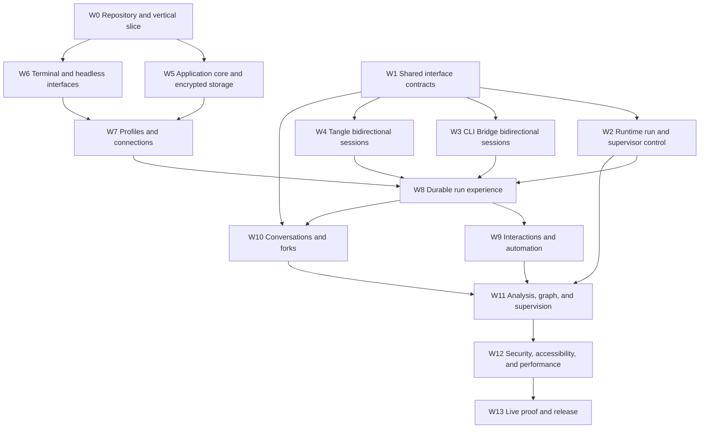

# Delivery plan

## Outcome

The delivery is one production Braid release that satisfies the complete product contract across local CLI Bridge, Tangle inference, Tangle sandbox, interactions, forks, analysis, runtime supervision, security, and proof.

The work is complete only at package publication and post-publication verification.

No work package represents optional later work unless the item is explicitly listed as a product non-goal.

## Dependency graph

W0, W1, initial W3 runner adapters, and deterministic test-fixture authoring can begin concurrently.

W2, W3, and W4 can proceed concurrently after the W1 type contract is approved.

W5 and W6 use deterministic ports while upstream packages are being published.

No live integration work waits for all interface polish, but no live claim is made before the packed Braid binary drives the path.

## W0: Repository, package, and vertical slice

### Repository

`tangle-network/braid`

### Deliverables

- Initialize `@tangle-network/braid` as one strict TypeScript ESM package with binary `braid`.
- Require the current supported Node.js 22 line or newer and commit `pnpm-lock.yaml`.
- Add formatting, lint, type, build, test, package, license, and dependency-boundary infrastructure.
- Pin the current `@earendil-works/pi-tui` release and add its license inventory.
- Adapt Pi's test-only terminal helper behind Braid's test suite with immutable source and license attribution because the published package exposes the terminal interface but not that helper.
- Create the source layout, application composition root, typed ports, deterministic clock and identifier adapters, and minimal reducer.
- Implement one deterministic provider fixture that streams text and completes.
- Render one real Pi TUI transcript and composer from the reducer.
- Drive the same send operation through `braid rpc` and terminal keyboard input.
- Pack the npm tarball and execute both interfaces from clean temporary installations.
- Add the copied-source notice check before adapting any upstream component.

### Vertical-slice checks

| ID | Required proof |
| --- | --- |
| VT-01 | Typing and sending one prompt in the packed terminal binary produces deterministic streaming text and one terminal result through the application reducer. |
| VT-02 | The editor preserves multiline ASCII, CJK, combining marks, emoji, paste, undo, completion, and cursor position across all four reference sizes. |
| VT-03 | The equivalent packed `braid rpc` command produces the same durable events and semantic final state as VT-01. |
| VT-04 | Replaying 10,000 deterministic events renders the recent viewport without duplicate content, unbounded retained rows, or event loss. |
| VT-05 | Searchable overlay, focus return, resize, alternate-screen cleanup, inline mode, and `NO_COLOR` pass real PTY checks. |
| VT-06 | The dependency graph contains Pi TUI but no Pi coding-agent, Kimi SDK, OpenCode application, Hermes runtime, provider-native parser, or second agent loop. |

### Done when

All six vertical-slice checks pass from the packed package and ADR 001 remains valid.

If Pi TUI fails two essential primitives, pause application component work, record the failures, and run the OpenTUI reversal comparison defined in the hypothesis before changing renderer.

## W1: Shared interface contracts

### Repository

`tangle-network/agent-sdk`, primarily `packages/agent-interface` and provider testkit packages.

### Deliverables

- Add interaction capabilities for kinds, answer specifications, scopes, secret answers, concurrency, replay, and response idempotency.
- Add typed interaction response and acknowledgement operations to environment and session contracts.
- Add stable run-bound control references needed to reconstruct a durable run client.
- Define a runtime/provider-neutral event envelope with stable run, event, sequence, and cursor semantics or the exact lower-level fields needed for runtime to provide it.
- Define side-effect-free portable context plan, accepted plan digest, context-transfer receipt, and native context-boundary proof types for fresh sessions, cross-runner handoff, and verified continuation.
- Add retry-safe checkpoint and fork request types with idempotency keys, canonical request digests, lookup, conflict, and cleanup semantics.
- Reuse existing `BackendMessage`, `InputPart`, `StreamEvent`, and interaction types instead of creating duplicate message or event unions.
- Add schema and runtime validators for every new wire value.
- Extend provider testkit conformance for response idempotency, wrong binding, replay, rejected context plans, accepted receipt digests, continuation boundaries, retry-safe checkpoint and fork, detach, and capability denial.
- Document compatibility and publish the package release.

### Done when

`UP-01`, `UP-02`, `UP-12`, `UP-13`, and `UP-14` pass against the packed interface and provider-testkit tarballs.

The public API review must prove that a client can represent the required behavior without provider-native fields or Braid types.

## W2: Runtime event, run, context, and supervisor control

### Repository

`tangle-network/agent-runtime`

### Deliverables

- Extend `RuntimeStreamEvent` or its public envelope to preserve every canonical interface event required by Braid.
- Preserve stable event identifiers, monotonic sequence, replay cursor, occurrence time, and run identity through box, executor, and chat paths.
- Add a public runtime run handle with start or resume, event replay, status, interaction response, explicit cancel, and durable reconstruction semantics.
- Extend `AgentExecutionBackend` and environment adapters without introducing a Braid-specific execution path.
- Plan canonical portable conversation context without dispatch, bind execution to an accepted plan digest, and return a matching complete context-transfer receipt.
- Keep native same-session continuation distinct from fresh context transfer and require provider boundary proof before continuation.
- Add a typed supervisor watch, steer, and cancel client that works in-process and through the runtime's durable control route.
- Implement or remove the unread `cancel.request.json` behavior so no public control claims a nonexistent effect.
- Keep pause, resume, and ask unavailable until they have real acknowledged runtime semantics.
- Export runtime-owned supervisor snapshot and control types from a stable package surface.
- Resolve the `agent-eval` peer range against the current compatible release and publish runtime.
- Update runtime documentation and tests in the same change.

### Done when

`UP-03`, `UP-04`, `UP-10`, `UP-11`, and `UP-13` pass against the packed runtime tarball.

A standalone control client must reconnect after its original JavaScript process exits and still observe or control a real retained run when the execution path reports durability.

## W3: CLI Bridge canonical bidirectional sessions

### Repositories

`drewstone/cli-bridge` and `tangle-network/agent-sdk` package `agent-provider-cli-bridge`.

### Deliverables

- Evolve the proposed `SessionRunner` into the canonical event and interaction contract rather than a second `BridgeEvent` product protocol.
- Add native bidirectional runner adapters for every runner advertised as interactive.
- Normalize message, reasoning, tool, plan, question, permission, usage, status, session, warning, error, and terminal events.
- Add stable session and run storage, live event replay, transcript retrieval, status, explicit cancel, next-turn input, and active-run steering with separate semantics.
- Expose a stable provider context boundary for native continuation or report continuation as unverified.
- Add an idempotent interaction response route bound to authenticated run, interaction, and caller operation identifiers.
- Preserve the current OpenAI-compatible one-shot route for non-interactive clients.
- Report one-shot runners as interaction false and detach according to actual adapter behavior.
- Remove ACP first-option auto-approval and OpenCode headless allow defaults from interactive mode.
- Keep explicit unattended execution available only through a separately named and receipted policy.
- Preserve exact profile materialization and receipts for every adapter.
- Make the provider package expose live, replay, detach, session, response, status, cancel, and context behavior exactly as the server proves it.
- Publish bridge server release metadata and provider package release.

### Runner order

Implement one native protocol end to end before broadening adapters.

1. Pi establishes the renderer-adjacent local reference and exact profile flow.
2. Codex establishes a different protocol family and cross-runner context transfer.
3. Claude Code and Kimi Code share the stream-JSON lineage but receive independent conformance runs.
4. OpenCode establishes daemon-backed sessions and real question or plan behavior.
5. Hermes and ACP establish generalized agent-to-client requests when their current protocols support them.
6. Remaining runners are labeled interactive only after the same conformance flow passes.

This order does not permit shipping a partial advertised matrix.

### Done when

`UP-05` through `UP-08`, `SE-03`, and `LIVE-01` through `LIVE-05` pass.

Closing a Braid interface and explicitly cancelling a run must produce different server and provider outcomes in a test that inspects terminal state.

## W4: Tangle bidirectional sessions and workspace operations

### Repositories

`tangle-network/agent-sdk` package `agent-provider-tangle` plus the owning sandbox service or SDK repository for any missing server method.

### Deliverables

- Carry canonical interaction requests in sandbox session events and accept idempotent typed responses.
- Preserve interaction state and replay across Braid disconnect and reconnect.
- Recover an exact retained dispatch by deterministic keys after caller death and before local reference commit.
- Expose run cancellation separately from environment destruction.
- Validate inline profiles and return effective capability, placement, session, usage, and confidentiality evidence.
- Prove workspace read, write, exec, Git, upload, download, checkpoint, and fork methods against current deployment support.
- Make checkpoint and fork idempotent by caller key and canonical request digest, add lookup after caller restart, and reject changed-input key reuse.
- Return immutable checkpoint source and destination environment references plus placement metadata and expose confirmed checkpoint and destination cleanup.
- Expose verified attestation inputs and evidence through the current confidential-execution contract.
- Publish the provider package and any required sandbox package or service release.

### Done when

`UP-09`, `UP-14`, `LIVE-06` through `LIVE-10`, and `SE-09` pass against a real current deployment.

The live cleanup report must confirm every test environment and checkpoint is destroyed after evidence capture.

## W5: Application core and encrypted storage

### Repository

`tangle-network/braid`

### W5 delivered 2026-08-02

W5 adds the complete domain graph, exhaustive reducer, atomic durable effect admission, encrypted SQLite journal, operating-system credential port, protected headless key sources, durable restore recovery, and release checks.

The coordinator records `pending` before a handler can dispatch, binds an operation to a canonical request digest, reconciles identical retries, records `acknowledged`, `failed`, `unknown`, `terminal`, and `conflict` outcomes, and fails closed when a pending external operation cannot be reconciled.

Production composition opens `better-sqlite3-multiple-ciphers@13.0.3` through `StoragePort` and the operating-system credential port; the deterministic in-memory adapter remains available through the same ports for the fixture.

Stable unit, contract, coordination, RPC, virtual-terminal, PTY, storage, crash, security, performance, live-prerequisite, install, capture, and release-check scripts are included.

### Deliverables

- Implement branded identifiers, domain invariants, graph entities, typed intents, journal events, pure reducer, and effect descriptions.
- Implement one serialized effect coordinator with atomic operation admission, operation identifiers bound to canonical request digests, and explicit acknowledged, failed, unknown, conflict, and terminal outcomes.
- Implement the SQLite journal, incremental transactional projections, WAL, SQLCipher-equivalent encryption, per-conversation content keys held outside SQLite, integrity checks, no-clobber backups, manifest-based restore recovery, migrations, rebuild, retention, tombstoned deletion, key destruction, and verified redaction rewrite.
- Store profile snapshots, connection references, conversations, branches, turns, runs, messages, parts, interactions, analyses, graph edges, drafts, queues, rules, and bindings.
- Implement duplicate-event, sequence-gap, cursor, missing-history, and projection-checksum behavior.
- Implement the operating-system credential port and accept headless database keys only through a protected file descriptor or mode-0600 file outside the workspace.
- Implement startup recovery and non-terminal run reconciliation hooks.
- Add production-adapter forced-kill tests at every SQLite durable commit and filesystem transition boundary, plus a two-process effect-admission test and native 10k/100k measurements.

### Done when

`AR-03` through `AR-07`, `AR-10`, `PR-09`, `PC-08` through `PC-10`, `CF-01`, `CF-08`, `SE-01`, `SE-02`, `SE-06`, `SE-07`, and the storage rows of the reliability matrix pass.

Incremental projection and full journal replay must produce matching canonical checksums for the release property-test corpus.

W5 is complete in source when the focused coordinator, reducer, security, storage, crash, package, and release-contract checks pass against the exact production dependencies.

The external live-provider prerequisite remains a later release check and is reported as an external blocker rather than simulated by the W5 fixture.

## W6: Terminal and headless interfaces

### Repository

`tangle-network/braid`

### Deliverables

- Implement the JSONL protocol and every required command over the application core, requiring caller-created operation identifiers for all mutating commands and rejecting changed-body reuse.
- Implement Pi TUI layouts, transcript, composer, status, selectors, modal coordinator, interaction shell, graph shell, details, activity, profile editor, connection setup, and help.
- Implement immutable view models and typed intents with enforced dependency boundaries.
- Implement full-screen, inline, plain, no-color, high-contrast, reduced-motion, legacy keyboard, Kitty keyboard, mouse-optional, and responsive modes.
- Implement untrusted terminal sanitization before all text, markdown, diff, link, clipboard, title, notification, and image views.
- Adapt selected Pi or Kimi Code components only after replacing source domain types and adding attribution.
- Implement semantic cell snapshots, PTY driver, visual capture, and terminal cleanup.

### Done when

`UX-01` through `UX-05`, `UX-09`, `UX-10`, `AR-01`, `AR-02`, `VT-01` through `VT-06`, `SE-05`, `VR-02`, and `VR-06` pass.

The keyboard walk-through must use the packed binary at 80×24 and the narrow proof must use 40×12.

## W7: Profiles, connections, and first-run setup

### Repository

`tangle-network/braid`

### Deliverables

- Implement source adapters, discovery, import, selection, canonical validation, security checks, structured and raw editing, atomic save, export, and immutable snapshots.
- Cover every installed `AgentProfile` field and preserve unknown extension namespaces.
- Implement exact selection and run-override precedence.
- Use canonical harness, model, and effort helpers exclusively.
- Implement CLI Bridge, Tangle inference, and Tangle sandbox connection setup, health, capability, credentials, selection, and removal.
- Implement workspace trust by identity and configuration digest.
- Implement first-run setup and effective-run confirmation.
- Persist complete pre-admission and post-materialization receipts.

### Done when

`PR-01`, `PR-02`, `PR-03`, `PC-01` through `PC-12`, `UX-06`, and `SE-07` pass.

A repository search and dependency test must prove no Braid-owned runner/model matrix or reduced profile schema exists.

## W8: Durable run and transcript experience

### Repositories

`tangle-network/braid` against published outputs from W2, W3, and W4.

### Deliverables

- Implement run admission, immutable receipts, runtime event ingestion, stable message-part updates, tools, reasoning, artifacts, proposals, warnings, usage, cost, errors, and terminal outcomes.
- Implement provider-boundary-verified native continuation, background runs, input queue, typed steering, explicit cancel, detach, reconnect, replay, status reconciliation, and unknown state.
- Implement bounded transcript virtualization, tool-output detail, event detail, and activity.
- Preserve per-call and terminal usage with reported, estimated, observed-minimum, and unknown states.
- Record one secret-free execution environment for local CLI Bridge, direct inference, and sandbox paths.
- Implement shutdown behavior that distinguishes detachable and non-detachable runs.
- Run the packed Braid binary against CLI Bridge, Tangle inference, and Tangle sandbox.
- Run one Tangle Sandbox canary before a bounded three-proof durability cohort.
- Run the retained two-conversation multirun proof with concurrent streams, focus switching, targeted cancellation, restart replay, and exact cleanup as part of `LIVE-07`.
- Record exact cleanup, account identity, latency distributions, tokens, costs, placement, and resource observations for every cloud proof.

### Done when

`PR-04`, `UX-04`, `UX-09`, `AR-04`, `AR-05`, `LIVE-01`, `LIVE-02`, `LIVE-04`, `LIVE-06`, `LIVE-07`, and every replay, cancel, and terminal-state reliability row pass.

The event ledger must show zero duplicate displayed part and zero lost committed event across forced disconnect and restart cases.

`LIVE-07` cannot pass without the multirun artifact proving two independent conversations, both streamed runs, both focus switches, targeted cancellation, restart replay, and exact cleanup.

The artifact must record the canonical cancellation operation while branch B is still active after the activity browser closes.

The Tangle Sandbox cohort must leave zero resources owned by its exact operation identities.

## W9: Interactions and automation

### Repositories

`tangle-network/braid` against published interaction paths from W2, W3, and W4.

### Deliverables

- Implement generic answer-spec rendering for text, number, boolean, select, and secret values.
- Implement specialized question, permission, and plan views with safe subject previews.
- Implement concurrent interaction queue, timeout, cancellation, stale response, restart reconciliation, response idempotency, and conflict behavior.
- Implement once, session, persistent, and deny scopes only when the request offers them.
- Implement structured automation rules, dry-run, audit, conflict, expiry, use limit, disable, and deletion.
- Reject automation for every answer specification containing a secret field and prove no secret value enters a rule or audit record.
- Record non-secret interaction decisions for feedback trajectories.
- Prove real local and cloud interaction response through the packed terminal and headless interfaces.

### Done when

`PR-05`, `UX-07`, `AN-08`, `AN-09`, `SE-03`, `SE-04`, `SE-08`, `LIVE-03`, and `LIVE-08` pass.

An interaction completes on a matching accepted or already-resolved acknowledgement, explicit interaction-resolution event, cancellation, expiry, or terminal run.

A later resumed-run event is useful activity evidence but is not required when the provider proceeds directly to terminal output.

## W10: Conversations, context, and forks

### Repositories

`tangle-network/braid` against shared context and provider operations from W1 through W4.

### Deliverables

- Implement new, open, search, rename, archive, delete, branch, clone, fork, retry, and selected-result behavior.
- Implement side-effect-free portable context planning, size check, explicit transformation, accepted digest, transfer, and matching receipt; rejected plans dispatch nothing.
- Implement native continuation boundary verification, mismatch reconciliation, unavailable-proof fallback, and missing-session handoff.
- Implement cross-runner and cross-connection handoff with fresh provider identity.
- Implement cloud quiesce or boundary selection, retry-safe checkpoint and environment fork, same-key lookup after forced restart, independent destination binding, conflict handling, failure recovery, and confirmed cleanup operations.
- Implement graph integrity, restart recovery, canonical export, Markdown export, and safe import.

### Done when

`PR-06`, `CF-01` through `CF-10`, `LIVE-02`, `LIVE-09`, `SE-10`, and every checkpoint and fork reliability row pass.

The UI proof includes the source and destination file state of a real cloud environment fork together with its graph nodes.

## W11: Trace analysis, comparison, graph, and supervision

### Repositories

`tangle-network/braid`, consuming published `agent-eval` and `agent-runtime` APIs.

### Deliverables

- Implement source freeze, digest, trace reference, analyst selection, budget, dispatch, progress, cancellation, and result persistence through `buildDefaultAnalystRegistry(...).runExactStream(...)` from `agent-eval`.
- Implement `/ask`, failure, cost, tools, improvement, paired comparison, citation validation, finding promotion, and fork from analysis.
- Implement feedback trajectory export from structured decisions.
- Implement the complete graph with conversation, branch, turn, run, analysis, environment, checkpoint, supervisor, and worker nodes and named edges.
- Implement runtime-owned supervisor snapshot watch, activity, log tail, typed steering, typed cancellation, and reconnect through the published Runtime APIs.
- Make the `LIVE-11` release proof provision an owned Runtime root and worker, validate complete observation, changed spend, acknowledged steering, proven cancellation, stable operation retries, fresh reconnect, and exact cleanup.
- Record exact terminal takeover only when Runtime returns an opaque handle for a registered provider; preserve the explicit unavailable capability otherwise.
- Keep direct-turn, trace-analysis, and delegated-worker usage separate until Runtime exports stable shared call identity.
- Add calibrated semantic cases and raw evidence capture.

### Done when

`PR-07`, `PR-08`, `AN-01` through `AN-10`, `LIVE-11`, `LIVE-12`, and `EVAL-01` through `EVAL-06` pass.

`LIVE-11` cannot pass from a queued request, an incomplete snapshot, an unacknowledged effect, or a partial result.

An analysis cannot pass if its source branch journal changes before explicit promotion or any cited reference fails deterministic resolution.

## W12: Security, accessibility, performance, and product polish

### Repositories

`tangle-network/braid` plus valid fixes in owning upstream repositories when a boundary test exposes them.

### Deliverables

- Complete the threat fixtures, secret canaries, encryption proof, path races, protocol fuzzing, dependency scan, static analysis, and independent security review.
- Complete all reference layouts, semantic themes, no-color, high contrast, reduced motion, keyboard remapping, IME, Unicode, plain output, and accessibility text.
- Complete error, empty, loading, stale, unavailable, unauthorized, reconnect, cancelling, expired, unknown, storage failure, and cleanup states.
- Profile and optimize measured application overhead without weakening correctness or security.
- Capture every required still and flow recording from the packed binary.
- Run a product-design audit against the full workflow and fix every valid severity finding.

### Done when

`PR-10`, `UX-01` through `UX-10`, `SE-01` through `SE-12`, `PERF-01` through `PERF-10`, `VR-03`, `VR-06`, and `VR-07` pass.

No critical or high security finding, inaccessible primary action, or missed performance target remains open.

## W13: Direct product use, package release, and registry verification

### Repositories

All owning repositories for final compatible releases, then `tangle-network/braid`.

### Deliverables

- Verify every upstream package from packed release candidates and publish in dependency order.
- Install the resulting registry packages into Braid and commit the exact lockfile.
- Run `pnpm check` once against the exact main commit.
- Build one immutable package with `pnpm release:prepare` and use its installed CLI, RPC, and terminal flows.
- Keep live, performance, semantic, soak, and complete-manifest audits available as explicit product audits.
- Run the protected `Release Live Evidence` workflow against the exact main commit and candidate Release run.
- Require a passed `LIVE-10` check, aggregate Tangle receipts, and the separate `LIVE-07` multirun artifact bound to the candidate commit, tarball, dependency digest, and Runtime version.
- Require the publish job to reject missing, stale, tampered, or source-checkout live evidence.
- Require a passed `LIVE-07` multirun artifact before release completion; provider or sandbox availability may still block that completion rather than becoming an unavailable claim.
- Endorse the exact candidate package and package manifest in an isolated code-free job.
- Publish `@tangle-network/braid` with npm provenance.
- Download the registry package in clean supported environments and repeat the post-publication smoke.
- Require matching candidate and registry package digests plus successful plain messaging, encrypted storage, and temporary-state cleanup on Linux x64 and macOS arm64.
- Validate the four platform results and npm provenance in one publication record.
- Endorse that fixed release bundle in an isolated code-free job.
- Tag the source commit and attach the package, publication records, screenshots, and flow recording.

### Done when

The exact main commit passes `pnpm check` and `pnpm release:prepare`.

The protected live-evidence workflow passes `LIVE-06` through `LIVE-10` against the exact candidate tarball.

Both candidate checks and both registry checks must pass.

The registry package SHA-256 must match the approved candidate.

The npm provenance must bind the package to the exact commit and release workflow.

Comprehensive product audits report their own status without blocking an otherwise usable package release.

## Requirement ownership

| Requirement range | Primary work package | Admissible evidence |
| --- | --- | --- |
| `PR-01`–`PR-03` | W7 | Packed UI/headless plus real connections |
| `PR-04` | W8 | Durable live replay ledger |
| `PR-05` | W9 | Real local and cloud interaction |
| `PR-06` | W10 | Deterministic preview plus real cloud fork |
| `PR-07`–`PR-08` | W11 | Real analysis and runtime control |
| `PR-09` | W5 | Forced restart and journal checksum |
| `PR-10`–`PR-11` | W6 and W12 | PTY recording and headless equivalence |
| `PR-12` | W13 | Exact package plus candidate and registry use records |
| `UX-01`–`UX-10` | W6 and W12 | Virtual terminal, PTY, captures, and keyboard walkthrough |
| `AR-01`–`AR-10` | W0, W5, W6, and W13 | Static boundaries, property tests, package install, and dependency inventory |
| `UP-01`–`UP-14` | W1 through W4 | Owning-repository contract, package, and live artifacts |
| `PC-01`–`PC-12` | W7 | Schema, filesystem, credential, connection, and live materialization tests |
| `CF-01`–`CF-10` | W10 | Graph properties, context receipts, forced restarts, and live environment fork |
| `AN-01`–`AN-10` | W9 and W11 | Deterministic citations, `agent-eval` records, live analyst, and automation audit |
| `SE-01`–`SE-12` | W3, W4, W5, W6, W9, W10, and W12 | Security tests, live auth boundaries, scans, packed installation, and live analysis |
| `ST-01`–`ST-10` | W5 and W12 | Encryption, transaction, replay, migration, integrity, retention, and concurrency tests |
| `VT-01`–`VT-06` | W0 | Packed vertical slice |
| `LIVE-01`–`LIVE-12` | W3, W4, W8, W9, W10, and W11 | Real provider and runtime artifacts |
| `PERF-01`–`PERF-10` | W12 | Full measured distributions |
| `EVAL-01`–`EVAL-06` | W11 | Calibrated `agent-eval` records |
| `VR-01`–`VR-10` | W13 | Explicit signed exact-build audit manifest |
| `US-01`–`US-10` | W0, W6, W12, and W13 | Dependency inventory, attribution, boundary tests, upgrade evidence, packed installation, and live analysis |

The comprehensive audit verifier extracts required identifiers from the committed specification and fails if the audit manifest omits one.

## Upstream pull-request and release order

1. Open and merge the `agent-sdk` interface and testkit contract change.
2. Develop runtime, CLI Bridge, and Tangle provider or service changes concurrently against the packed interface release candidate.
3. Merge and publish the interface package.
4. Rebase or merge each consumer onto its current main, rerun its full suite, and publish bridge/provider/runtime packages in dependency order.
5. Update Braid to registry packages, never workspace links, and run contract plus one live smoke before broader release testing.
6. Finish Braid feature pull requests with required terminal stills and recordings.
7. Freeze the Braid release candidate only after all feature changes merge.
8. Run `pnpm check`, build and use the packed candidate, then publish only that digest.
9. Install and use the registry package on all supported platforms before tagging the release.

Every upstream behavior change updates its owning documentation in the same pull request.

Every push receives current CI and review reinspection before the package is treated as ready.

## Rollback and failure policy

Braid can pin a prior compatible shared package release and disable a capability whose upstream release regresses.

It cannot silently replace a real interaction, fork, replay, or control feature with an approximation.

An npm publication failure stops before tag and announcement and preserves the approved candidate artifacts.

A post-publication smoke failure marks the release withdrawn or deprecated, records the exact failure, and ships a corrected version rather than mutating an existing package.

A database migration failure restores the pre-migration encrypted backup and blocks write mode.

A live resource cleanup failure keeps the release active only as a blocked operation until the resource is reconciled and cannot be hidden in a successful report.

## Final definition of done

All work packages are merged in their owning repositories.

All required shared packages and Braid are published at compatible versions.

The registry-downloaded Braid package completes the required first-run, local, cloud, interaction, fork, analysis, supervisor, restart, and export workflows.

Every requirement identifier maps to passing exact-build evidence.

All required terminal captures and flow recordings are attached.

All live resources are confirmed cleaned up.

No unresolved critical or high security, correctness, accessibility, architecture, or product-design finding remains.

Only then may the implementation goal be marked complete.
