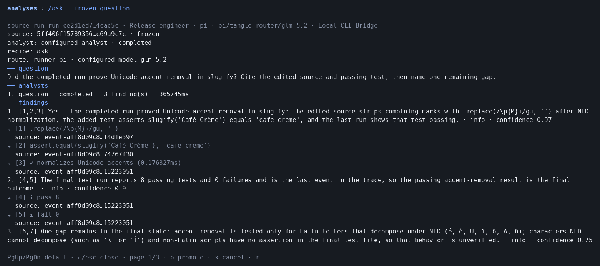

# A code change and a cited review

The task was to finish a JavaScript `slugify` function: normalize accents, replace punctuation and underscores, trim dashes, and lowercase.
The agent edited the implementation, added edge cases, and ran eight tests.
All eight passed in the captured run.

Then the user asked:

```text
/ask Did the completed run prove Unicode accent removal in slugify? Cite the edited source and passing test, then name one remaining gap.
```



The analysis cited the combining-mark replacement, the `Café Crème` assertion, and the passing test output.
It also noted that the tests did not cover every script or character that Unicode normalization cannot decompose.
These are findings about this recorded run, not a guarantee of general Unicode correctness.

## Capture source

This is an unchanged screenshot from a real installed Braid 0.3.2 release-candidate run on September 26, 2026.
It uses Pi through Local CLI Bridge and the `glm-5.2` route.
It is not a fixture, and it is not a capture from the final public npm archive.

| Recorded item | Value |
| --- | --- |
| Captured at | 2026-09-26 10:06:05 UTC |
| Tested source | `4c6f15df37c9236f0d963cc9ab16fca418032255` |
| Equivalent merged source tree | `d476fe7353f63e792d920ba254ff879e9682a53d` |
| Installed candidate archive SHA-256 | `2d7d56e7becbf932b6f5bef17a07f8b29ea2874b4a0f2e8b405e9d271ec19479` |
| Screenshot SHA-256 | `0088e9fecbd4c770e7f349b111082f1e04376fcd24f363e7a575b2b9ca8773a8` |
| Workspace checks | 8 passed, 0 failed |
| Analysis | 3 findings with supported citations; 6 model calls |
| Analysis duration | 365.748 seconds |
| Analysis cost | Actual cost unknown; estimated model cost $0.0816942 |

The recording demonstrates a completed coding task and a review with citations.
It does not establish typical latency, total billed cost, or equivalent behavior on every runner.
The measured analysis took over six minutes.
Use the [release notes](https://github.com/tangle-network/braid/releases/tag/v0.3.2) for the published release, and the [capability comparison](../launch/comparison.md) for other recorded routes.
