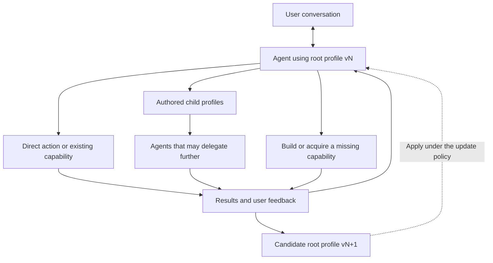

# Independent GPT-6 Pro audit: architecture and build sequence

Your research question: What is the smallest sound architecture and delivery path for the supplied one-root-AgentProfile vision, and which tempting abstractions should be rejected?

Take the role of a principal engineer reviewing a consequential platform decision. Deliver a technically specific audit, not encouragement, generic agent advice, or an implementation PR. Read the supplied context and full root-agent draft before deciding. Inspect the actual repositories and current primary documentation when tools permit. A proposed path must distinguish code already shipped in Braid, reusable published upstream capabilities, later source that is not integrated, and genuinely missing contracts.

Address all of the following in depth:

1. Test the central claim. Can one canonical root AgentProfile express objective discovery, profile authoring, capability acquisition, personalization, and revision policy without becoming a second application runtime? Distinguish configuration, executable skills, user knowledge, active commitments, evaluation policy, and execution authority. Explain the narrowest necessary upstream change if the canonical contract is insufficient. Do not invent a new profile dialect.
2. Trace the complete user flow: start from a seed profile, converse about an ambiguous need, adopt useful work, author a child profile, dispatch through a native or cloud path, consume and check an artifact, propose a root revision, activate it under policy, disconnect, and return. For each boundary identify the owner, exact immutable inputs, durable identifiers, side effects, failure state, and evidence the user should see. Be explicit when a step is not supported by inspected current source.
3. Explain the control hierarchy. How do native goals, native workflow scripts, native children, Runtime workers, cloud execution, and self-improvement coexist without duplicate coordinators, completion authorities, budgets, or retries? What stays native? What must remain mechanically enforced outside the root's writable profile? Which semantics should not be normalized?
4. Give at least three plausible architectures, including the strongest simple baseline. Compare integration cost, usability, durability, native capability loss, coupling, and reversibility. Recommend one, and identify evidence that would make you change that recommendation. Keep research strategy in profiles and run artifacts rather than global framework defaults.
5. Design the first useful vertical slice and an ordered set of coherent implementation batches. Every batch must name owner repository, existing contract to reuse or extend, user-visible result, dependency, acceptance proof, and deletion or deferral opportunity. Separate a prototype that answers a question from a production promise. Do not prescribe dates unsupported by capacity evidence.
6. Specify a compact failure-injection plan. Cover a crash around child admission, a duplicate wake, interruption around profile activation, a cancelled parent with live descendants, unavailable native continuation, incomplete costs, stale profile resources, a withdrawn user preference, and a child result that fails independent checking. Explain the expected externally observable state for each.
7. Identify where always-on behavior actually lives and how another product can consume the same agent work without importing Braid's TUI. A constantly open terminal, repeated model calls, or a saved transcript do not by themselves establish this property.
8. Name the five most expensive mistakes this team could make, the smallest things to build now, and the things to explicitly avoid building. Include the possibility that improving native harnesses reduces the value of harness routing itself.

Expected output: a short decision, an evidence/status table, the recommended architecture, an implementation dependency table, a first-slice acceptance scenario, and ranked risks/deletions. Aim for a substantive 2,000-4,000-word audit when evidence supports it; do not pad or fabricate to reach a length. Cite actual paths/revisions or primary links for facts, and mark design proposals. End with your three strongest objections to your own recommendation and the next experiment that resolves the largest uncertainty.

Do not read another review of this proposal before forming your own conclusion. No writes, resource provisioning, or code execution with external effects are authorized. Missing access is an explicit limitation, not a reason to invent inspection.


---

# Shared review context

Prepared 2026-10-07 for three independent GPT-6 Pro research reviews. This is source material and a proposed vision, not evidence that the proposed system exists.

## User intent

The user wants one canonical AgentProfile at the first layer of Braid, the agent they converse with. It defines how that agent understands the user, identifies worthwhile objectives, decides whether action or conversation is appropriate, develops capabilities, authors child AgentProfiles through its chosen skills, and improves its own reusable behavior. A registry may offer starting profiles. Subsequent interactions can lead different users toward different profiles, methods, capabilities, objectives, and agent organizations. The runtime must not prescribe one universal hierarchy.

This is domain-general. Engineering and research are initial proof settings, not the intended product boundary. Consulting, business, farming, finance, trading, and continuing personal support were examples of possible applications, not authorization to deploy in those domains or a claim of professional competence. Some needs call for listening, clarification, or restraint rather than maximizing a numerical objective.

Capability creation is broader than spawning agents. The root could use an existing tool, write a deterministic program, train a small specialist model, gather a dataset, develop a procedure, commission an experiment, or involve a human. A learned decision should account for the cost of creating, verifying, integrating, and maintaining that capability, and whether it is likely to help future work.

The user explicitly requested full, deep independent audits with demanding expectations. Do not give a generic list of agent features or merely agree with the thesis. Distinguish general product architecture from domain-specific validation and deployment requirements.

## Required lifecycle

The user explicitly requires a responsive root that dispatches cloud agents, wakes when children return, pauses and resumes while a topology is live, and budgets across descendants. Audit the supplied lifecycle proposal as critically as the profile vision. Address durable inboxes versus transport notifications, crash-safe wakeups, conflicting user and worker events, exact subtree control, coordinator fencing, inherited reservations, unavailable native controls, and the limits of checkpoint recovery. Require deterministic failure tests and actual cloud consumer proof before making durability claims. Identify existing owner contracts before proposing another scheduler.

## Repository and implementation baseline

Primary repository: `tangle-network/braid`. Locally inspected base: `11f32f485e14e2f8f651d536a25c302227e3e9fd`, 2026-10-07. Inspect current main for the committed vision and source history. The source commit identifies the implementation baseline; the supplied packet carries the exact proposed root-agent and lifecycle documents so access limitations do not hide the design under review.

Verified in that source:

- Braid is a terminal client over agent-runtime, with a shared application core for terminal and JSONL control. It is not another agent loop, scheduler, profile compiler, model gateway, judge, or sandbox implementation.
- AgentProfile from agent-interface is the only agent configuration. Harness selection is a profile preference or run override, not agent identity.
- Providers own live processes and native sessions. Braid's local journal owns its conversation graph and user decisions. Identifiers for runs, sessions, environments, workers, interactions, branches, and profiles remain distinct.
- Runtime owns worker control and supervisor read APIs. Braid does not parse native output or supervisor-private files. Unsupported actions require capability checks, not simulated behavior.
- `/ask` analyzes a frozen run and creates separate cited evidence. Findings enter agent context only through explicit promotion.
- `/feedback accept|reject` stores explicit task judgments. `/profile learn` makes a reviewable canonical profile draft, explicitly labeled unmeasured. `/runner advice` requests observational advice and neither establishes causality nor automatically selects a runner.
- The latest retained live advice attempt failed workspace-routing authorization before any advice call. There is no live recommendation-quality result to extrapolate from it.
- Source package pins: Runtime 0.263.0, Interface 2.13.1, Eval 0.187.2. Nearby later source contains more durability, recursive coordination, and skill/profile/code improvement features. Later source availability is not proof of compatible published packages or Braid integration.
- The documented pinned root signal sink acts on cancel only; pause, resume, and ask are observational signals without an acknowledged runtime effect. Do not treat their names as implemented controls. Verify whether current upstream source changes this boundary.
- Existing local validation and packaged keyboard captures establish the recorded implementation checks, not automatic personal evolution, production fleet reliability, or measured superiority.

Useful primary repository paths to inspect through available tools:

| Repository | Paths |
| --- | --- |
| tangle-network/braid | `docs/01-product-contract.md`, `docs/04-runtime-contracts.md`, `docs/05-profiles-and-connections.md`, `docs/06-conversations-forks-and-analysis.md`, `src/app/profile-learning.ts`, `src/app/runner-advice.ts`, `src/adapters/runtime/supervisor-control.ts`, `package.json` |
| tangle-network/agent-runtime | `docs/improve.md`, `docs/durability.md`, `src/durable/pursuit-versions.ts`, `src/mcp/tools/coordination.ts` |
| tangle-network/discovery | `docs/02-architecture.md` |

Discovery's maintained architectural direction is recursive execution of an exact profile, task, inherited limits, and retained evidence. Behavior belongs in profiles and run-selected artifacts; there is no separate universal Discovery coordinator. Inspect current source before proposing reuse. If access fails, name the attempted repository/path and exact error, then reason from the supplied snapshot with that limitation.

## Current external comparison points

These are starting references, not permission to assume Braid adapters support them. Verify changing facts before relying on them.

- Claude dynamic workflows and ultracode: https://code.claude.com/docs/en/workflows
- Codex persistent goals: https://developers.openai.com/cookbook/examples/codex/using_goals_in_codex
- Pi extensions: https://github.com/earendil-works/pi/blob/main/packages/coding-agent/docs/extensions.md
- Pi Durable: https://earendil.com/posts/pi-durable/
- Deep Agents asynchronous workers: https://docs.langchain.com/oss/python/deepagents/async-subagents
- Controlled study of agent coordination: https://research.google/blog/towards-a-science-of-scaling-agent-systems-when-and-why-agent-systems-work/

Native workflows already offer substantial parallelism and responsive conversation. Prompt keywords, resumable chats, native goals, background sessions, and cross-host durable pursuits do not necessarily have equivalent semantics. More workers, longer conversations, and richer traces are not outcome improvements by themselves.

## Review authority and evidence rules

This is a read-only research item. Do not create branches, commits, pull requests, deployments, paid resources, cloud workers, or external messages. The deliverable is your complete written audit in this conversation. Implementation may follow a separate decision.

Use primary sources where you make external factual claims. Mark inspected facts, supplied facts, inferences, and proposals distinctly. Never invent APIs, filenames, measurements, jobs, tests, or access. A tool returning no data or refusing access is a useful finding. Report uncertainty rather than filling gaps with plausible detail.

Keep AgentProfile canonical and Braid a client. If you believe those constraints make the objective impossible, explain the precise contradiction and smallest justified upstream extension. Challenge the proposal where needed, but do not replace it with a fixed role hierarchy or a domain-specific workflow platform without explaining the loss of generality.

Preserve useful native behavior, exact admitted profile versions, bounded delegated resources and permissions, explicit update authority, and source-linked evidence. A profile can propose changing its methods; editing itself does not create execution authority or retroactively change acceptance criteria.

Produce a substantial written analysis with concrete examples, prioritized decisions, implementation ownership, and falsifying experiments. Explain your recommendations and assumptions without supplying private internal deliberation. Do not ask clarification questions; state reasonable assumptions and identify choices that genuinely need a user decision. A concise executive decision should precede the detailed audit.

## Complete proposed root-agent document

Review this exact proposal independently. Embedded relative links refer to the repository vision directory.

````markdown
# One evolving root agent

Updated 2026-10-07. Proposed product architecture, not a claim of current autonomous profile evolution.

The user begins a conversation with one agent, configured by one canonical `AgentProfile`. That profile can define how the agent discovers objectives, understands preferences, decides what to do, authors other profiles, and revises its own working methods. "Root" describes its place in this interaction; it is not a new profile type.

A default profile or a registry provides starting points. Neither needs a fixed menu of domains, permanent roles, or one prescribed orchestration strategy. Business, consulting, research, farming, financial work, and personal support are possible applications of the same mechanism. Domain-specific evidence, tools, and authority still determine what an application can actually provide.

## Let the profile define the method

| Choice | What the root profile can define |
| --- | --- |
| Understanding the user | How to ask, listen, retain corrections, and distinguish explicit preferences from tentative inferences |
| Discovering objectives | How to recognize needs, propose useful work, resolve competing priorities, and reconsider an obsolete goal |
| Acting | When to converse, investigate, use a tool, delegate, wait, or stop |
| Creating capabilities | When to write code, develop a skill, author a child profile, train a specialist model, or involve an external service or person |
| Learning | Which evidence to examine, how to propose revisions, and when a revision may become active |
| Continuing | Which events or commitments warrant resuming work, within the granted resources and authority |

These choices belong in the profile and its referenced skills or artifacts. Runtime validates and executes the resulting actions. Braid makes them understandable and controllable. Infrastructure must not quietly become a second agent deciding the user's objectives.

Objective discovery is part of the conversation. The agent may infer a possible need, but an inference is not automatically an instruction or permission to act. Some conversations need listening or exploration rather than a measurable goal. Optimizing engagement or a convenient score is not evidence of serving the user.

## The same shape recurs

A profile-authoring skill can let the root write an exact child `AgentProfile`, give it a task and bounded resources, and inspect the result. That child may author further profiles if granted the capability. Roles and structures arise from the work; no universal team hierarchy is required.



This extends [Discovery's recursive approach](https://github.com/tangle-network/discovery/blob/main/docs/02-architecture.md). Native children and Runtime workers retain their distinct execution contracts.

The general action is to solve or obtain a solution to a subproblem. Another AI is one option. A deterministic program, procedure, dataset, experiment, trained small model, or human contribution may fit better. Capability-building earns its cost when it improves this task or enough future tasks after training, checking, integration, and maintenance are counted.

## Personal evolution without losing continuity

Conversation can update knowledge about the user, current work, or reusable behavior. These are different changes. A profile defines behavior; it does not contain the whole conversation, private memory, credentials, active jobs, or model weights. It references capabilities through supported contracts.

Retain each applied profile revision, its reason, and the evidence used. Existing runs keep their exact admitted profiles. The update policy may permit routine personalization and require review for larger changes; editing a profile cannot grant itself broader execution authority. Preferences can be corrected or withdrawn. A candidate may be rolled back when it performs worse.

Two users can start from the same seed and develop different profiles, capabilities, objectives, and delegation structures. Preserve that history so they can understand, export, or fork their own evolution. Sharing a starting profile does not share private state or promise identical outcomes.

An always-available agent also needs Runtime-owned persistence, event delivery, scheduling and recovery. The profile defines when and why it should continue. Keeping a terminal open or repeatedly calling a model does not provide those guarantees.

The [durable lifecycle requirements](root-lifecycle.md) define how this root receives child outcomes, stays responsive, pauses and resumes an active topology, and accounts for shared resources. These guarantees precede autonomous profile evolution. The same logical root may span many admitted runs with exact profile versions.

First proof: start two bounded interactions from the same profile with different user needs. Let the agent propose objectives, author a useful child profile or capability, and propose a justified root revision. Check that each result fits its user, survives restart, and preserves exact provenance. Include a case where the right behavior is conversation without delegation or a new objective.
````

## Complete proposed lifecycle requirements

Challenge these requirements and their sequencing; they are proposals, not existing APIs.

````markdown
# Durable root and worker lifecycle

Proposed 2026-10-07. These are acceptance requirements, not claims that the pinned Runtime or Braid already implements them. The [root profile](root-agent.md) defines decisions; Runtime owns execution and recovery; Cloud owns sandbox lifecycle; Braid presents and controls their acknowledged state.

The user talks to one logical root across many runs. That root can remain responsive while children work, receive their results after an absence, and explain what changed. A logical root is not a permanently running model process or a new AgentProfile type.

## Required behavior

| Capability | Required contract |
| --- | --- |
| Durable event inbox | Retain user input, child outcomes, interactions, timers, and authorized external events with source identity, deduplication identity, and ordering information. An MCP notification can prompt delivery; it must not be the only record of unfinished work. |
| Wake and dispatch | Committing a child outcome makes a root continuation discoverable even if the root is offline. Recovery closes the gap between persisting that outcome and scheduling its consumer. Repeated delivery cannot admit duplicate work. |
| Responsive conversation | User input can inspect or steer an active pursuit without waiting for every child. Runtime serializes conflicting decisions and fences stale coordinators. Parallel reasoning may produce proposals; it cannot race to commit conflicting changes. |
| Exact delegation | Record parent linkage, immutable profile and task, acceptance criteria, granted authority, resource reservation, environment, artifacts, and operation identity. A timed-out submission is reconciled before retrying. |
| Topology controls | Address an exact root, subtree, or worker. Record requested scope and each acknowledged effect, including unavailable or unknown descendants. Children created concurrently must obey the effective parent control state. |
| Resource accounting | Reserve capacity before child admission, inherit narrower limits recursively, reconcile actual usage, and release reservations only on evidence. Count root work, descendants, analysis, retries, tool usage, and infrastructure. Missing usage is unknown, never free. |
| Recovery | Restore committed decisions, unconsumed events, profile receipts, pending interactions, worker bindings, artifacts, and accounting. Discover still-running workers before replacing them. Preserve unsupported native-session recovery as a visible limitation. |
| Verified completion | Separate provider termination, artifact delivery, acceptance, and objective completion. A successful child exit does not establish that its result is correct or that the root's task is finished. |
| Explainable waiting | Say what is active, blocked, awaiting the user, scheduled, or unknown; give the last observed progress and next wake condition. A heartbeat establishes liveness, not useful progress. |
| Revocation and revision | Apply steering, withdrawn authority, and objective changes at explicit boundaries. Late results retain provenance but cannot revive cancelled work or activate an obsolete profile revision. |

Native subagents and Runtime cloud workers may support different controls. Retain those distinctions. Reuse existing canonical identities and owner contracts before adding fields or another abstraction.

## Stop and resume must mean something precise

| Operation | Meaning |
| --- | --- |
| Detach the client | Close Braid while authorized remote work continues. Reattach reconstructs an honest view from owner state and retained events. |
| Pause root continuation | Stop admitting new root decisions and delegation. Already-admitted children follow the recorded policy, continue or receive their own control request. Their events accumulate durably. |
| Pause a subtree | Prevent new descendant admission and request supported suspension of existing work. Show pending, unsupported, and unknown effects. Never label an active process suspended because a request was accepted. |
| Resume | Reconcile from a checkpoint and consume subsequent events under current authority and remaining resources. Do not repeat already-committed effects. |
| Cancel | Revoke future admission for the selected scope, propagate cancellation, and reconcile running work and reservations. Completion needs acknowledgements or an explicit unresolved state. |
| Fork from a point | Create distinct work with explicit conversation, profile, workspace, and external-state copy semantics. It does not undo actions in the world or clone all live processes. |

A topology checkpoint describes a recoverable boundary and any in-flight work. It need not be an atomic snapshot of every sandbox. The contract must state which state was captured, which work still runs, and how recovery resolves uncertainty. Retention expiry must be visible before a checkpoint is advertised as resumable.

## Bounded autonomy

The root can allocate its remaining allowance; a child cannot mint a fresh allowance by spawning another child. Runtime enforces admission, concurrency, depth, deadlines, and scoped authority independently of writable profile text. Reservations and settlement need one authoritative owner and fencing against concurrent admissions.

Reserve enough capacity for checking results, reporting, and shutdown. Decide what happens when a cap is near: narrow work, return a partial result, wait for an authorized increase, or stop. Do not promise a hard currency cap when a provider lacks enforceable limits or timely usage. Expose the enforceable bound and remaining uncertainty.

Durable subscriptions and timers need stable identities, cancellation, and catch-up rules. Batch related completions and apply backpressure rather than invoking the root model for every token or heartbeat. Approval requests survive restarts with their original scope and expiry. A missing user answer never becomes permission. Child artifacts and external events remain untrusted input, even when they claim authority.

## Failure tests that earn the durability claim

| Fault or race | Required observable result |
| --- | --- |
| Crash before or after child admission acknowledgement | One child execution or an explicit unresolved admission; no blind replacement. |
| Child commits while root is offline, or crash before wake is queued | Outcome survives and becomes consumable after recovery; no lost wake. |
| Duplicate, delayed, or reordered events | Stable final state and one admitted continuation for the same committed decision. |
| User steering and child completion arrive together | Defined ordering; accepted steering is preserved and stale results cannot override it. |
| Two coordinators recover the root | Only the current owner can commit; the stale owner cannot dispatch or spend. |
| Pause or cancel races with grandchild creation | Effective scope prevents new admission; every existing descendant has an acknowledged or explicit unresolved state. |
| Restart with pending approval or profile activation | No implicit approval, lost decision, duplicate activation, or mutation of admitted run receipts. |
| Concurrent children reserve the last capacity | Reservations remain within the enforceable parent allocation, including descendants. Late usage and abandoned work remain accountable. |
| Worker or host disappears | Reconcile provider state, leases and retained evidence before replacement. Keep uncertain effects unknown. |
| Resume an old checkpoint or expired sandbox | Explain captured state, later effects, and missing resources. Never imply the external world was rolled back. |
| Child exits successfully with a bad artifact | Root rejects or repairs the result under its remaining budget; objective remains incomplete. |
| Burst of outcomes, revoked authority, or obsolete timer | Bounded queue processing; no new unauthorized work or revival of cancelled objectives. |

Use deterministic assertions and fault injection for ledger, accounting, and lifecycle invariants. Use a small number of semantic evaluations for the quality of objectives, delegation, and synthesis. Retain tests that detect these consequential failures; remove tests that merely repeat implementation details only after checking their unique coverage.

First integration proof: through Braid, launch a root with two real cloud children and one bounded grandchild; disconnect Braid; let one child finish; pause and resume the supported scope; restart the coordinator; steer the objective; cancel a subtree; reconnect and inspect the accepted artifact, outstanding work, and reconciled budget. Inject duplicate delivery and uncertain admission in the same owner contracts. Record exact builds, profiles, run and environment identities, fault timing, event receipts, effects, and remaining gaps. Fake-provider tests support this proof but cannot replace it.

Test larger fleets only after this flow passes. Define recovery time, event backlog, concurrency, cancellation latency, and spend bounds before increasing scale. A graph with thousands of nodes proves rendering capacity, not durable execution.
````
