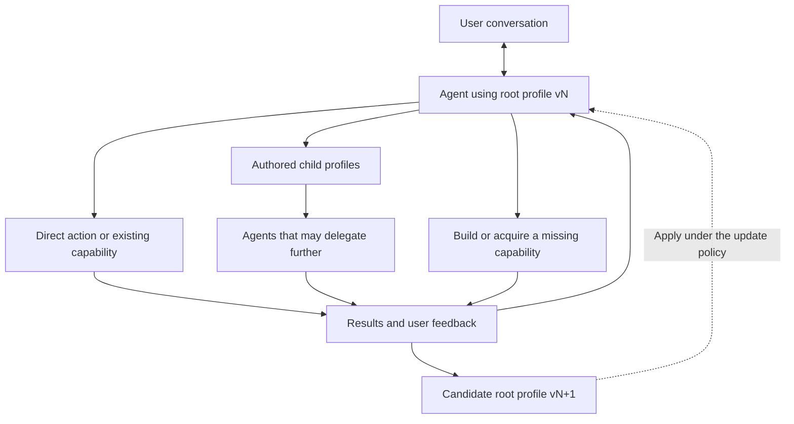

# One evolving root agent

Updated 2026-10-07. Proposed product architecture, not a claim of current autonomous profile evolution.

The user begins a conversation with one agent, configured by one canonical `AgentProfile`. That profile can define how the agent discovers objectives, understands preferences, decides what to do, authors other profiles, and revises its own working methods. "Root" describes its place in this interaction; it is not a new profile type.

A default profile or a registry provides starting points. Neither needs a fixed menu of domains, permanent roles, or one prescribed orchestration strategy. Business, consulting, research, farming, financial work, and personal support are possible applications of the same mechanism. Domain-specific evidence, tools, and authority still determine what an application can actually provide.

## Let the profile define the method

| Choice | What the root profile can define |
| --- | --- |
| Understanding the user | How to ask, listen, retain corrections, and distinguish explicit preferences from tentative inferences |
| Discovering objectives | How to recognize needs, propose useful work, resolve competing priorities, and reconsider an obsolete goal |
| Acting | When to converse, investigate, use a tool, delegate, wait, or stop |
| Creating capabilities | When to write code, develop a skill, author a child profile, train a specialist model, or involve an external service or person |
| Learning | Which evidence to examine, how to propose revisions, and when a revision may become active |
| Continuing | Which events or commitments warrant resuming work, within the granted resources and authority |

These choices belong in the profile and its referenced skills or artifacts. Runtime validates and executes the resulting actions. Braid makes them understandable and controllable. Infrastructure must not quietly become a second agent deciding the user's objectives.

Objective discovery is part of the conversation. The agent may infer a possible need, but an inference is not automatically an instruction or permission to act. Some conversations need listening or exploration rather than a measurable goal. Optimizing engagement or a convenient score is not evidence of serving the user.

## The same shape recurs

A profile-authoring skill can let the root write an exact child `AgentProfile`, give it a task and bounded resources, and inspect the result. That child may author further profiles if granted the capability. Roles and structures arise from the work; no universal team hierarchy is required.

This extends [Discovery's recursive approach](https://github.com/tangle-network/discovery/blob/9e6118f764bae60017dc3fc99c90fb93bd6dbf0f/docs/02-architecture.md). Native children and Runtime workers retain their distinct execution contracts.

The general action is to solve or obtain a solution to a subproblem. Another AI is one option. A deterministic program, procedure, dataset, experiment, trained small model, or human contribution may fit better. Capability-building earns its cost when it improves this task or enough future tasks after training, checking, integration, and maintenance are counted.

## Personal evolution without losing continuity

Conversation can update knowledge about the user, current work, or reusable behavior. These are different changes. A profile defines behavior; it does not contain the whole conversation, private memory, credentials, active jobs, or model weights. It references capabilities through supported contracts.

Retain each applied profile revision, its reason, and the evidence used. Existing runs keep their exact admitted profiles. The update policy may permit routine personalization and require review for larger changes; editing a profile cannot grant itself broader execution authority. Preferences can be corrected or withdrawn. A candidate may be rolled back when it performs worse.

Two users can start from the same seed and develop different profiles, capabilities, objectives, and delegation structures. Preserve that history so they can understand, export, or fork their own evolution. Sharing a starting profile does not share private state or promise identical outcomes.

An always-available agent also needs Runtime execution persistence and recovery, Platform-owned sleeping event and timer waits, and Sandbox workspace recovery. The profile defines when and why it should continue. Keeping a terminal open or repeatedly calling a model does not provide those guarantees.

The [durable lifecycle requirements](root-lifecycle.md) define how this root receives child outcomes, stays responsive, pauses and resumes an active topology, and accounts for shared resources. These guarantees precede autonomous profile evolution. The same logical root may span many admitted runs with exact profile versions.

First proof: start two bounded interactions from the same profile with different user needs. Allow objectives, child profiles, capabilities, and root revisions where justified. Do not require them in every interaction. Check that each result fits its user, survives restart, and preserves exact provenance. Include a case where the right behavior is conversation without delegation or a new objective.
